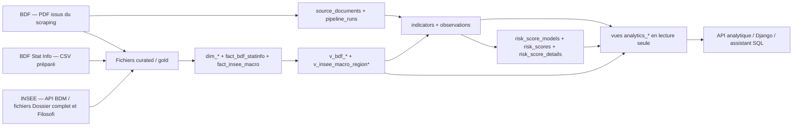

# Modèles de données analytiques

Ce dossier isole le patrimoine analytique du reste de la base applicative.
Il décrit le parcours complet des données : sources brutes, fichiers préparés,
stockage relationnel, agrégations et vues finales exposées en lecture seule.

## Documents

- [MCD](mcd.md) : concepts métier, sources et associations.
- [MLD](mld.md) : relations, clés logiques et dépendances de calcul.
- [MPD](mpd.md) : objets PostgreSQL, colonnes, contraintes, index et vues.

## Chaîne analytique

## Sources de vérité

| Niveau | Objets principaux | Origine dans le code |
|---|---|---|
| Brut | PDF BDF, réponses API et archives INSEE | `src/inclusion_financiere.py`, `src/risk_score/*_import.py` |
| Préparé | CSV/JSONL `data/processed/**` | pipelines de nettoyage et d’harmonisation |
| Mart | `dim_*`, `fact_bdf_statinfo`, `fact_insee_macro` | `src/storage/analytics_db.py` |
| Opérationnel analytique | `source_documents`, `indicators`, `observations`, `risk_score_*` | `src/storage/models.py` |
| Agrégations | vues `v_bdf_*`, `v_insee_macro_region*` | `src/storage/analytics_db.py`, `src/storage/conformed_dimensions.py` |
| Publication | six vues `analytics_*` | `src/storage/schema_migrations.py` |

`fact_surendettement`, `v_surendettement_annual` et
`v_surendettement_with_insee_macro` sont conservés pour l’historique mais sont
dépréciés. Le flux courant de surendettement repose sur `observations` puis sur
les scores versionnés.

