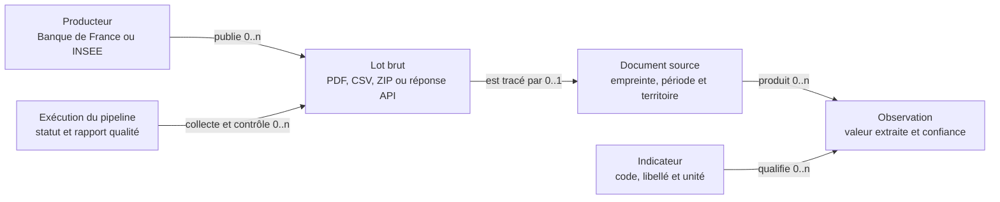
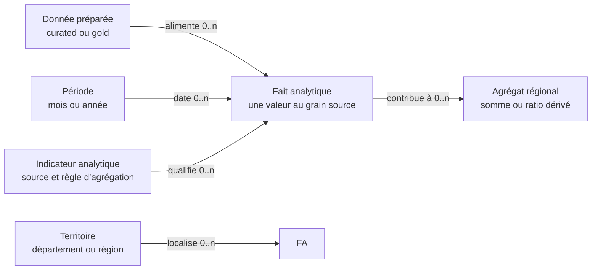
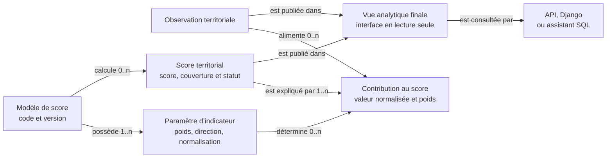

# MCD analytique

Le MCD est découpé en trois vues pour éviter un diagramme unique illisible.
Les fichiers bruts restent hors de PostgreSQL ; leur provenance est enregistrée
dans les documents sources et les exécutions de pipeline.

## 1. Acquisition et traçabilité

## 2. Mart analytique et agrégations

## 3. Scoring et publication

## Cardinalités importantes

| Source | Cardinalité | Cible | Règle |
|---|---:|---|---|
| Document source | 1 → 0..n | Observation | une observation possède exactement un document |
| Indicateur | 1 → 0..n | Observation | une observation possède exactement un indicateur |
| Modèle de score | 1 → 1..n | Paramètre | chaque modèle définit ses indicateurs pondérés |
| Modèle de score | 1 → 0..n | Score | un score appartient à une version de modèle |
| Score | 1 → 1..n | Contribution | les contributions expliquent le résultat |
| Vue finale | 1 → 0..n | Consommateur | la vue ne stocke aucune donnée propre |

