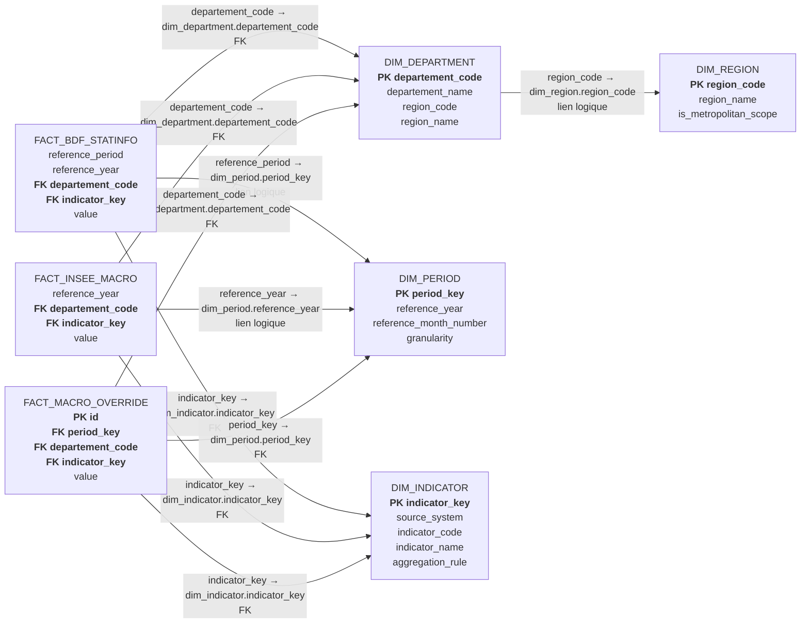
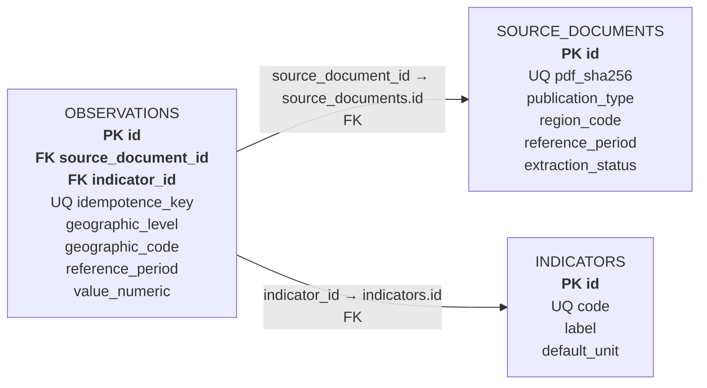
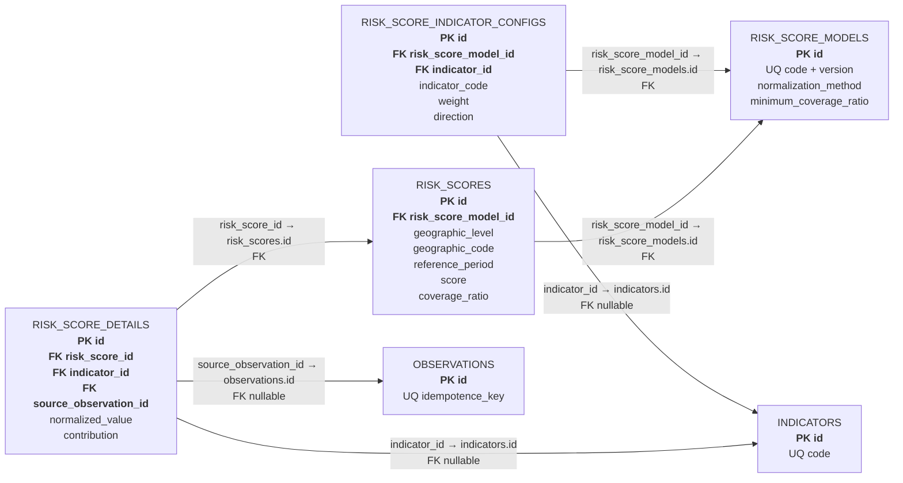
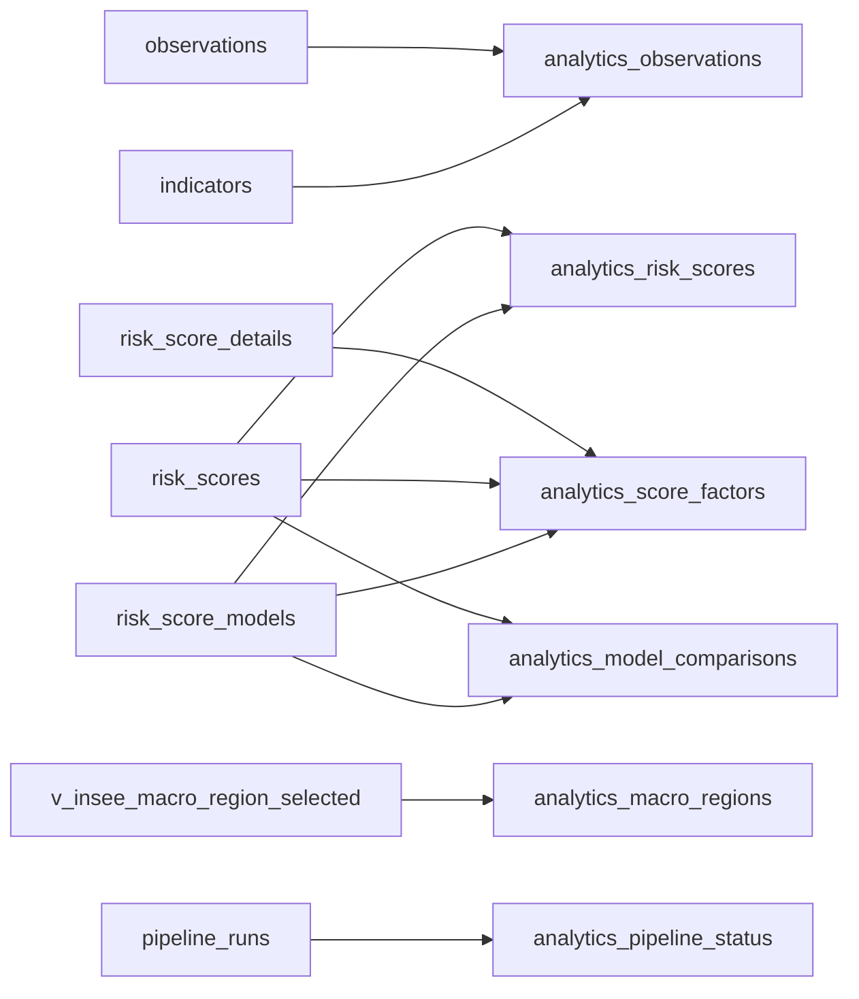

# MLD analytique

Chaque relation indique explicitement la colonne source et la colonne cible.
`FK` signifie clé étrangère physique ; `lien logique` signifie que le
rapprochement est réalisé sans contrainte PostgreSQL.

## 1. Mart BDF et INSEE

### Clés métier du mart

| Relation | Clé ou unicité |
|---|---|
| `dim_region` | `region_code` |
| `dim_department` | `departement_code` |
| `dim_period` | `period_key` |
| `dim_indicator` | `indicator_key` |
| `fact_bdf_statinfo` | `(reference_period, departement_code, indicator_key)` |
| `fact_insee_macro` | `(reference_year, departement_code, indicator_key)` |

## 2. Observations et traçabilité

| Relation | Cardinalité |
|---|---|
| `source_documents.id` ← `observations.source_document_id` | 1 document → 0..n observations |
| `indicators.id` ← `observations.indicator_id` | 1 indicateur → 0..n observations |

## 3. Scores territoriaux

### Unicités du scoring

| Relation | Unicité métier |
|---|---|
| `risk_score_models` | `(code, version)` |
| `risk_score_indicator_configs` | `(risk_score_model_id, indicator_code)` |
| `risk_scores` | `(risk_score_model_id, geographic_level, geographic_code, reference_period)` |
| `risk_score_details` | `(risk_score_id, indicator_code)` |

## 4. Dépendances des vues finales

Les vues `analytics_*` constituent la seule interface SQL accordée au rôle
`analytics_readonly` de l’assistant.

