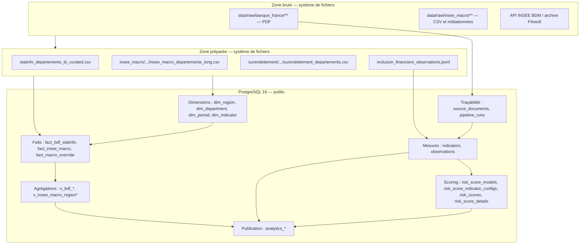
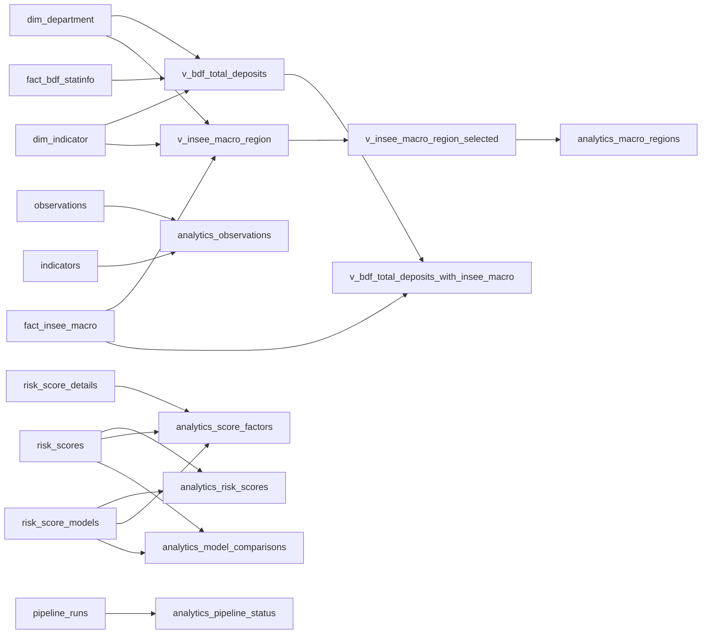

# MPD analytique PostgreSQL 16

Ce MPD décrit les objets physiques actifs du schéma `public`. Les fichiers
bruts et préparés sont des zones de transit hors PostgreSQL ; ils figurent dans
le diagramme de déploiement pour rendre visible la chaîne complète.

## Comment lire ce document

1. La zone brute conserve les fichiers tels que publiés par BDF ou INSEE.
2. La zone préparée homogénéise codes, périodes, unités et formats.
3. Les tables `dim_*` et `fact_*` forment le mart analytique.
4. Les vues `v_*` calculent les agrégations intermédiaires.
5. Les vues `analytics_*` sont les sorties finales consommées par les services.

Les correspondances colonne à colonne sont détaillées dans le [MLD](mld.md),
afin de garder le MPD centré sur les objets physiques.

## Déploiement physique des données

## Tables du mart

| Table | Grain / clé | Colonnes physiques principales | Contraintes et index structurants |
|---|---|---|---|
| `dim_region` | `region_code` | `varchar(16)`, nom, périmètre métropolitain | PK code, nom unique |
| `dim_department` | `departement_code` | code/nom département, code/nom région | PK code, index région |
| `dim_period` | `period_key` | année, mois nullable, granularité | PK ; `CHECK` mois/année |
| `dim_indicator` | `indicator_key` | source, code, nom, groupe, unité, règle d’agrégation | PK métier |
| `fact_bdf_statinfo` | mois × département × indicateur | période, année, mois, valeur, source, version pipeline | UQ `(reference_period, departement_code, indicator_key)` ; FK département/indicateur |
| `fact_insee_macro` | année × département × indicateur | année, valeur, jeu source, version pipeline | UQ `(reference_year, departement_code, indicator_key)` ; FK département/indicateur |
| `fact_macro_override` | période × département × indicateur | valeur corrigée, justification, dates | PK `id` ; FK période/département/indicateur ; index de recherche |
| `pipeline_metadata` | source du snapshot | version BDD, système, chemin, date de construction | traçabilité du mart construit |

## Tables d’observation et de scoring

| Table | Grain / clé | Relations |
|---|---|---|
| `source_documents` | une version de document (`id`) | empreinte SHA-256 unique ; porte URL, chemin, période, territoire et statut d’extraction |
| `pipeline_runs` | une exécution (`id`) | configuration, résultats d’étapes, qualité et erreur sérialisés |
| `indicators` | un indicateur (`id`, code unique) | catalogue opérationnel utilisé par les observations et le score |
| `observations` | une mesure idempotente (`id`) | FK document et indicateur ; UQ `idempotence_key` ; index territoire/période/indicateur |
| `risk_score_models` | un modèle versionné (`id`) | UQ `(code, version)` ; méthode de normalisation et seuil de couverture |
| `risk_score_indicator_configs` | un indicateur par modèle (`id`) | FK modèle/indicateur ; UQ `(risk_score_model_id, indicator_code)` |
| `risk_scores` | modèle × niveau × territoire × période | FK modèle ; score 0–100, couverture 0–1, statut contrôlé ; clé métier unique |
| `risk_score_details` | score × indicateur | FK score/indicateur/observation source ; valeurs brute, normalisée, poids et contribution |

## Graphe physique des vues

## Vues finales publiées

| Vue | Grain | Usage |
|---|---|---|
| `analytics_observations` | observation | séries territoriales enrichies du libellé indicateur |
| `analytics_risk_scores` | score territorial versionné | classement, niveau de risque et couverture |
| `analytics_score_factors` | contribution d’indicateur | explication détaillée du score |
| `analytics_model_comparisons` | territoire × période × paire de versions | évolution du score entre versions |
| `analytics_macro_regions` | année × région × indicateur | agrégats et ratios macroéconomiques régionaux |
| `analytics_pipeline_status` | exécution | supervision de la production des données |

Le rôle PostgreSQL `analytics_readonly` possède uniquement `USAGE` sur
`public` et `SELECT` sur ces six vues. Il n’a pas d’accès direct aux tables.

## Objets historiques

`fact_surendettement`, `v_surendettement_annual` et
`v_surendettement_with_insee_macro` existent encore pour audit. Ils ne doivent
pas être utilisés comme source des nouveaux écrans ou requêtes analytiques.
