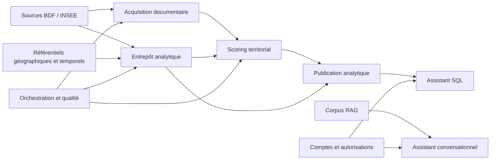

# Domaines fonctionnels

Le découpage combine les FK physiques, les flux du code et la responsabilité
des objets. Il ne repose pas uniquement sur les préfixes de tables.

| Domaine | Objets principaux | Nature |
|---|---|---|
| Acquisition documentaire | `source_documents`, `indicators`, `observations` | opérationnel |
| Référentiels | `dim_region`, `dim_department`, `dim_period`, `dim_indicator` | dimensions conformes |
| Entrepôt BDF/INSEE | `fact_bdf_statinfo`, `fact_insee_macro`, `fact_macro_override`, vues `v_*` | analytique |
| Scoring territorial | `risk_score_models`, `risk_score_indicator_configs`, `risk_scores`, `risk_score_details` | configuration et faits calculés |
| Orchestration et qualité | `pipeline_runs`, `pipeline_metadata`, registres de migration/dépréciation | technique et exploitation |
| Comptes et autorisations | tables Django `auth_*`, `django_session`, `django_admin_log` | applicatif et personnel |
| Conversations | `assistant_conversation`, `assistant_conversationmessage` | applicatif, personnel ou sensible |
| RAG Django historique | `assistant_ragsource`, `assistant_ragdocument*`, `assistant_ragchunk`, `assistant_ragindexrun` | déprécié, audit uniquement |
| Assistant SQL/RAG | schéma `assistant` : `corpus_chunks`, `sql_executions` | actif et canonique, audit et recherche |
| Publication analytique | vues `analytics_*` | interface de lecture stable |
| Historique | `surendettement_data`, `fact_surendettement` et vues associées | historique/déprécié |

## Dépendances entre domaines

La flèche entre entrepôt et scoring représente le flux applicatif observé dans
`src/risk_score/analytics_bridge.py`, pas une FK PostgreSQL. De même, la
publication `analytics_*` est une interface par vues.

## Frontières à clarifier

1. `dim_indicator` et `indicators` décrivent deux catalogues sans clé de
   correspondance contrainte.
2. Le corpus RAG Django déprécié et le corpus canonique Assistant API n'ont
   aucune relation physique ni synchronisation démontrée.
3. L'entrepôt et le stockage opérationnel partagent actuellement `public`, bien
   qu'ils aient des cycles de création distincts.
4. Les codes territoire/période servent de liens transverses mais plusieurs FK
   correspondantes ne sont pas matérialisées.
5. `sql_executions.actor_id` est textuel et ne référence pas `auth_user`.

Ces frontières guideront les diagrammes détaillés ; aucune contrainte nouvelle
n'est proposée dans ce lot documentaire.
