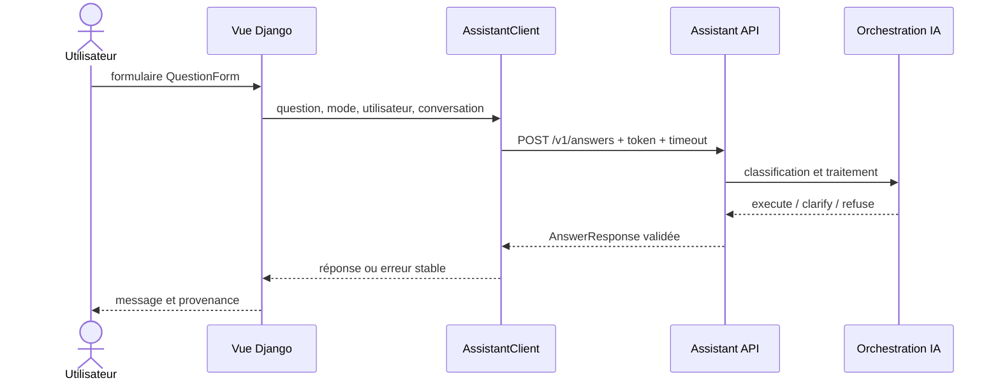

# C10 — Intégration dans l'application

## Flux réel

Fichiers : `web/assistant/forms.py`, `views.py`, `client.py`, `contracts.py`,
`models.py` et `web/templates/assistant/conversations.html`.

Le client applique un timeout explicite, transmet le token hors du contenu JSON,
valide la réponse et transforme timeout, connexion, 401/403, autres 4xx, 5xx et JSON
invalide en messages sans traceback. Les décisions sont conservées dans le contrat ;
`execute` affiche le résultat, `clarify` une question et `refuse` un refus contrôlé.

Le formulaire Django produit un label associé. La page utilise titres, sections,
boutons clavier, `role="alert"`, `aria-live="polite"` et du texte explicite : aucune
information critique ne repose uniquement sur la couleur.

Tests déterministes : `web/assistant/test_client.py` et `web/assistant/test_views.py`.
Ils utilisent des mocks et n'appellent aucun LLM.

## Démonstration

Ouvrir `http://localhost:8000/assistant/`, se connecter avec un compte autorisé,
envoyer une question puis capturer la question, la réponse et les sources. Refaire avec
une demande ambiguë, une demande interdite, puis arrêter `assistant-api` et vérifier le
message d'indisponibilité. Tester Tab, Shift+Tab et l'annonce du message d'erreur avec
un lecteur d'écran.
