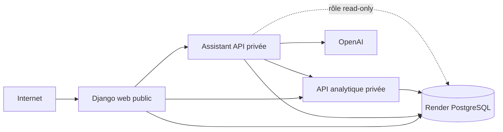

# C13 — Préparation du staging Render

Ce document prépare un vrai staging mais ne prétend pas qu'il est déjà déployé.

## Architecture



Le Blueprint est `render.yaml`. Tous les services utilisent `docker/Dockerfile` ; Render
construit son dernier stage puis remplace la commande selon le service.

| Service | Visibilité | Commande | Port | Health | Dépendances |
|---|---|---|---:|---|---|
| `surendettement-staging-web` | public | Gunicorn Django | `$PORT` | `/health/ready/` | DB, API, Assistant |
| `surendettement-staging-api` | privé | Uvicorn `app.main` | 10000 | TCP Render, HTTP `/api/data/health` | DB |
| `surendettement-staging-assistant` | privé | Uvicorn `assistant_api.main` | 10000 | TCP Render, HTTP `/health` | DB, API, OpenAI |
| `surendettement-staging-db` | privé | PostgreSQL managé | 5432 | géré par Render | aucune |

Les services privés nécessitent un plan payant. Les rendre publics uniquement pour
éviter ce coût dégraderait l'isolation. Render ne propose pas de health check HTTP pour
un service privé : son contrôle natif est TCP. Les endpoints HTTP restent testables
depuis le Shell Render du service.

## Secrets à renseigner

- `OPENAI_API_KEY`
- `ANALYTICS_READONLY_DATABASE_URL` (peut rester vide jusqu'à la création du rôle)

Render génère `ASSISTANT_INTERNAL_TOKEN` et `DJANGO_SECRET_KEY`, puis partage le token
entre services sans l'inscrire dans Git. `OPENAI_MODEL` reste configurable.

## Déploiement initial

1. Créer un compte Render et ouvrir le Dashboard.
2. Connecter GitHub dans **Account Settings > Git Providers**.
3. Autoriser `ludivineRB/surendettement_analyse`.
4. Pousser la branche validée : Render ne voit pas le dépôt local.
5. Choisir **New > Blueprint** puis sélectionner le dépôt et la branche.
6. Conserver le chemin `render.yaml`.
7. Vérifier les quatre ressources et la région `Frankfurt`.
8. Saisir les secrets demandés, sans les inclure dans une capture.
9. Cliquer sur **Deploy Blueprint** et suivre séparément les builds.
10. Attendre Django healthy sans conclure que les données métier sont déjà chargées.

Les références `fromDatabase` et `fromService` injectent les connexions privées. Le
hostname public Render est automatiquement ajouté aux hôtes Django et aux origines CSRF.

## Initialisation PostgreSQL

Les pre-deploy commands créent de façon idempotente les schémas opérationnel,
Assistant et Django, puis collectent les fichiers statiques. Ils ne téléchargent ni ne
remplacent de données métier.

La base vierge permet le démarrage, mais tableaux, scores et réponses fondées sur les
données restent vides. Les SQLite sources sont locaux et absents de l'image. Pour les
importer :

1. Dans Render PostgreSQL, ouvrir **Info**, autoriser temporairement l'IP de
   l'administrateur et copier l'URL externe sans la publier.
2. Localement, exécuter :

```bash
# Copier l'URL externe Render, puis remplacer uniquement son préfixe
# postgresql:// par postgresql+psycopg://.
export RENDER_STAGING_DATABASE_URL='postgresql+psycopg://<utilisateur>:<mot-de-passe>@<hote>:<port>/<base>'
export TARGET_DATABASE_URL="$RENDER_STAGING_DATABASE_URL"
python -m src.storage.migrate_to_postgres

export CONFIRM_ANALYTICS_MIGRATION=yes
export ADMIN_DATABASE_URL="$RENDER_STAGING_DATABASE_URL"
python -m src.storage.migrate_analytics_to_postgres
```

Ces commandes sont idempotentes par défaut et n'utilisent pas `--replace-snapshot`.
Contrôler les rapports, puis retirer l'autorisation IP temporaire.

Pour activer le SQL read-only, générer localement un mot de passe fort, puis lancer :

```bash
export ADMIN_DATABASE_URL="$RENDER_STAGING_DATABASE_URL"
export ANALYTICS_READONLY_PASSWORD='<SECRET-NON-COMMITÉ>'
export CONFIRM_ANALYTICS_ROLE=yes
python -m src.storage.configure_analytics_readonly
```

Dans Render, construire `ANALYTICS_READONLY_DATABASE_URL` à partir de l'URL **interne**
avec l'utilisateur `analytics_readonly`, puis la saisir dans l'Assistant. Ne jamais la
mettre dans Git ou une capture.

Après validation des sources documentaires, ouvrir le Shell de l'Assistant et lancer
`python -m assistant_api.cli index`. Cette opération n'est pas automatique.

## Vérification et smoke tests

```bash
curl -i https://<django-host>/health/live/
curl -i https://<django-host>/health/ready/
```

Depuis le Shell Render de l'API :

```bash
curl -i http://127.0.0.1:$PORT/api/data/health
```

Depuis le Shell Render de l'Assistant :

```bash
curl -i http://127.0.0.1:$PORT/health
curl -i http://127.0.0.1:$PORT/health/ready
```

Ouvrir `https://<django-host>/`, créer explicitement un compte autorisé et vérifier le
parcours Assistant. Aucun health check ne contacte OpenAI.

## Preuves RNCP

- Blueprint et commit Git associé ;
- PostgreSQL créé, sans afficher sa connexion ;
- quatre ressources Render vertes ;
- logs de build et pre-deploy sans secrets ;
- historique de déploiement ;
- health Django public ;
- health API et Assistant depuis leurs Shells ;
- application Django publique et parcours Assistant ;
- import et indexation seulement après réussite réelle.

## Rollback

Dans **Events**, sélectionner un déploiement précédemment validé puis utiliser l'action
de rollback/redéploiement proposée. Revérifier readiness et smoke tests. Cette procédure
n'a pas encore été testée sur un staging réel.

## Limites

- PostgreSQL gratuit expire après 30 jours, sans sauvegarde.
- Django gratuit peut subir un cold start après 15 minutes.
- API et Assistant privés impliquent un coût ; vérifier le tarif avant Apply.
- Le système de fichiers Render est éphémère ; PostgreSQL porte la persistance.
- OpenAI implique disponibilité, quota, coût et traitement externe.
- Prometheus, Grafana, Loki et Alertmanager restent locaux.

Références : [Blueprint Render](https://render.com/docs/blueprint-spec),
[health checks](https://render.com/docs/health-checks) et
[limites gratuites](https://render.com/docs/free).
