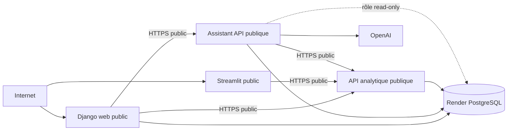

# C13 — Préparation du staging Render

Ce document prépare un vrai staging mais ne prétend pas qu'il est déjà déployé.

## Architecture



Le Blueprint est `render.yaml`. Tous les services utilisent `docker/Dockerfile` ; Render
construit son dernier stage puis remplace la commande selon le service.

| Service | Visibilité | Commande | Port | Health | Dépendances |
|---|---|---|---:|---|---|
| `surendettement-staging-web` | public | Gunicorn Django | `$PORT` | `/health/live/` | DB, API, Assistant |
| `surendettement-staging-api` | public | Uvicorn `app.main` | `$PORT` | `/health/live` | DB |
| `surendettement-staging-assistant` | public | Uvicorn `assistant_api.main` | `$PORT` | `/health/live` | DB, API, OpenAI |
| `surendettement-staging-db` | privé | PostgreSQL managé | 5432 | géré par Render | aucune |
| `surendettement-staging-streamlit` | public | Streamlit | `$PORT` | `/_stcore/health` | API |

Les quatre applications sont explicitement des Web Services `free`. Render interdit
aux Web Services gratuits de recevoir du trafic privé : les appels inter-services
utilisent donc les URL HTTPS publiques attribuées par Render. Le Blueprint les récupère
avec `fromService.envVarKey: RENDER_EXTERNAL_URL` ; aucun hostname n'est fabriqué.
PostgreSQL reste privé grâce à `fromDatabase.connectionString` et `ipAllowList: []`.

## Secrets à renseigner

- `OPENAI_API_KEY`
- `ANALYTICS_READONLY_DATABASE_URL` (peut rester vide jusqu'à la création du rôle)

Render génère `ASSISTANT_INTERNAL_TOKEN` et `DJANGO_SECRET_KEY`, puis partage le token
entre services sans l'inscrire dans Git. `OPENAI_MODEL` reste configurable.

## Déploiement initial

1. Créer un compte Render et ouvrir le Dashboard.
2. Connecter GitHub dans **Account Settings > Git Providers**.
3. Autoriser `ludivineRB/surendettement_analyse`.
4. Pousser la branche validée : Render ne voit pas le dépôt local.
5. Choisir **New > Blueprint** puis sélectionner le dépôt et la branche.
6. Conserver le chemin `render.yaml`.
7. Vérifier les cinq ressources, leur plan `Free` et la région `Frankfurt`.
8. Saisir les secrets demandés, sans les inclure dans une capture.
9. Cliquer sur **Deploy Blueprint** et suivre séparément les builds.
10. Attendre Django healthy sans conclure que les données métier sont déjà chargées.

`fromDatabase` injecte la connexion PostgreSQL interne avec ses identifiants, sans les
écrire dans Git. `fromService` transmet les URL publiques dynamiques de l'API et de
l'Assistant. Le hostname public Render est automatiquement ajouté aux hôtes Django et
aux origines CSRF.

## Initialisation PostgreSQL

Le plan gratuit ne supporte pas les pre-deploy commands. Les migrations idempotentes
de l'API, de l'Assistant et de Django, ainsi que `collectstatic`, sont donc exécutées au
début de leurs commandes de démarrage. Elles ne téléchargent ni ne remplacent de
données métier.

La base vierge permet le démarrage, mais tableaux, scores et réponses fondées sur les
données restent vides. Les SQLite sources sont locaux et absents de l'image. Pour les
importer :

1. Dans Render PostgreSQL, ouvrir **Info**, autoriser temporairement l'IP de
   l'administrateur et copier l'URL externe sans la publier.
2. Localement, exécuter :

```bash
# Copier l'URL externe Render, puis remplacer uniquement son préfixe
# postgresql:// par postgresql+psycopg://.
export RENDER_STAGING_DATABASE_URL='postgresql+psycopg://<utilisateur>:<mot-de-passe>@<hote>:<port>/<base>'
export TARGET_DATABASE_URL="$RENDER_STAGING_DATABASE_URL"
python -m src.storage.migrate_to_postgres

export CONFIRM_ANALYTICS_MIGRATION=yes
export ADMIN_DATABASE_URL="$RENDER_STAGING_DATABASE_URL"
python -m src.storage.migrate_analytics_to_postgres
```

Ces commandes sont idempotentes par défaut et n'utilisent pas `--replace-snapshot`.
Contrôler les rapports, puis retirer l'autorisation IP temporaire.

Pour activer le SQL read-only, générer localement un mot de passe fort, puis lancer :

```bash
export ADMIN_DATABASE_URL="$RENDER_STAGING_DATABASE_URL"
export ANALYTICS_READONLY_PASSWORD='<SECRET-NON-COMMITÉ>'
export CONFIRM_ANALYTICS_ROLE=yes
python -m src.storage.configure_analytics_readonly
```

Dans Render, construire `ANALYTICS_READONLY_DATABASE_URL` à partir de l'URL **interne**
avec l'utilisateur `analytics_readonly`, puis la saisir dans l'Assistant. Ne jamais la
mettre dans Git ou une capture.

Après validation des sources documentaires, ouvrir le Shell de l'Assistant et lancer
`python -m assistant_api.cli index`. Cette opération n'est pas automatique.

## Vérification et smoke tests

```bash
curl -i https://<django-host>/health/live/
curl -i https://<django-host>/health/ready/
curl -i https://<api-host>/health/live
curl -i https://<assistant-host>/health/live
curl -i https://<streamlit-host>/_stcore/health
```

Ouvrir `https://<django-host>/`, créer explicitement un compte autorisé et vérifier le
parcours Assistant, puis ouvrir Streamlit. Aucun health check ne contacte OpenAI et les
checks `/health/live` ne lancent pas de requête métier ou SQL.

## Preuves RNCP

- Blueprint et commit Git associé ;
- PostgreSQL créé, sans afficher sa connexion ;
- cinq ressources Render vertes et toutes marquées Free ;
- logs de build et de démarrage sans secrets ;
- historique de déploiement ;
- health Django public ;
- health publics API, Assistant et Streamlit ;
- application Django publique, parcours Assistant et dashboard Streamlit ;
- import et indexation seulement après réussite réelle.

## Rollback

Dans **Events**, sélectionner un déploiement précédemment validé puis utiliser l'action
de rollback/redéploiement proposée. Revérifier readiness et smoke tests. Cette procédure
n'a pas encore été testée sur un staging réel.

## Limites

- Un seul PostgreSQL gratuit est autorisé par workspace ; il est limité à 1 Go,
  expire après 30 jours, et ne fournit ni sauvegarde ni connection pooling.
- Chaque Web Service s'endort après 15 minutes sans trafic. Une requête Django peut
  réveiller successivement Django, Assistant et API, avec plusieurs cold starts pouvant
  prendre environ une minute chacun.
- Les quatre services partagent les 750 heures gratuites mensuelles du workspace et
  les quotas de bande passante/build. Sans carte, Render suspend les services ou les
  nouveaux builds en cas de dépassement au lieu de facturer.
- API et Assistant sont publiquement joignables pour contourner l'absence de trafic
  privé entrant sur Free. Le token interne protège les routes Assistant concernées,
  mais l'API data reste exposée : cette architecture convient uniquement à la démo RNCP.
- Le système de fichiers Render est éphémère ; PostgreSQL porte la persistance.
- OpenAI implique disponibilité, quota, coût et traitement externe.
- Prometheus, Grafana, Loki et Alertmanager restent locaux.

Références : [Blueprint Render](https://render.com/docs/blueprint-spec),
[health checks](https://render.com/docs/health-checks) et
[limites gratuites](https://render.com/docs/free).
