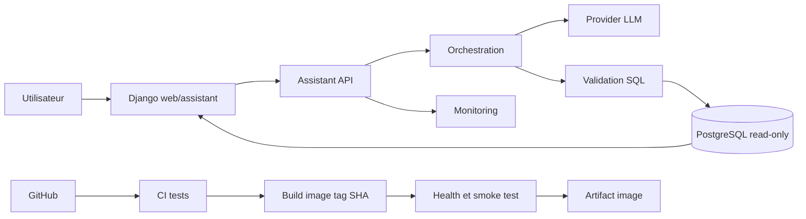

# E3 — Service IA intégré et livrable

## Périmètre et continuité E2 → E3

Le POC E2 reste isolé dans `benchmark/`. E3 industrialise le contrat de décision
`execute`, `clarify`, `refuse` dans l'application réelle, sans modifier le POC.



## Matrice de preuves

| Compétence | Preuve dans le dépôt | Preuve manuelle réelle |
|---|---|---|
| C9 | `assistant_api/`, `tests/test_assistant_api.py` | `/docs`, `/health`, appels authentifiés |
| C10 | `web/assistant/`, `web/templates/assistant/` | parcours navigateur et erreurs contrôlées |
| C11 | `assistant_api/monitoring.py`, `docker/monitoring/` | synthèse et dashboard après requêtes |
| C12 | tests et `.github/workflows/ci.yml` | pytest et exécution GitHub verte |
| C13 | job `package-assistant` | tag SHA, smoke test et artifact téléchargé |

## Démonstration locale

```bash
docker compose -f docker/compose.yaml up --build postgres api assistant-api django
curl http://localhost:8030/health
curl -H "X-Internal-Token: $ASSISTANT_INTERNAL_TOKEN" http://localhost:8030/monitoring/summary
```

Ouvrir ensuite `http://localhost:8030/docs` et `http://localhost:8000/assistant/`.
Les captures à réaliser sont : Swagger, refus 401, health, écran assistant avec les
trois décisions, erreur de service, synthèse monitoring, tests locaux, CI verte et
artifact SHA. Elles ne sont pas incluses car elles doivent provenir d'une exécution réelle.

Voir les documents C9 à C13 pour les commandes, limites et critères attendus.
