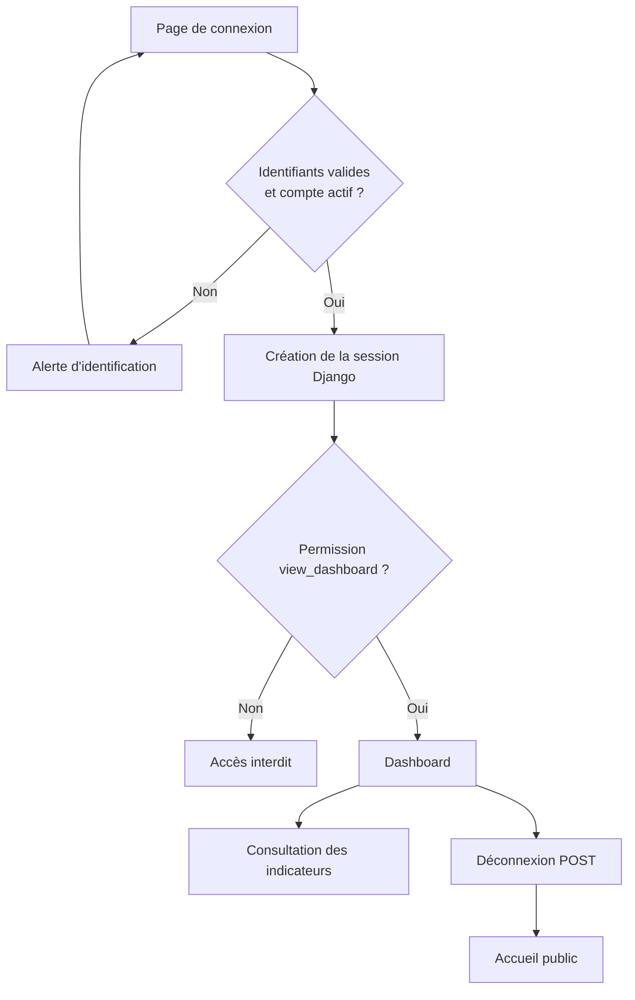
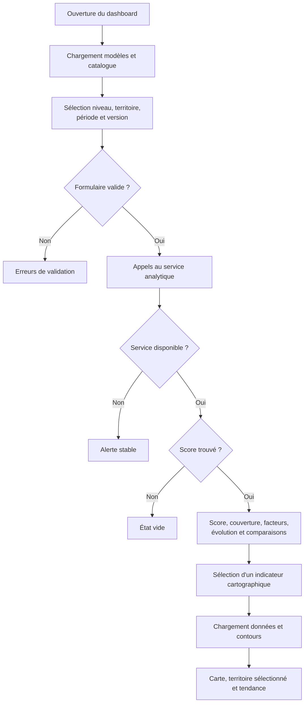
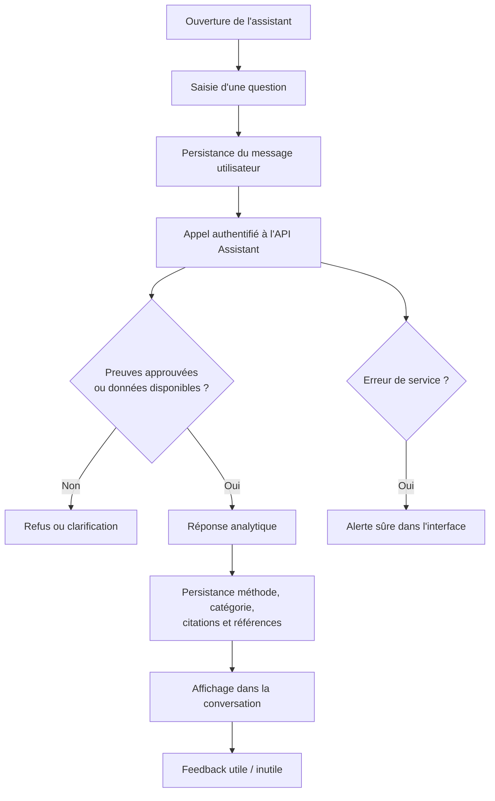
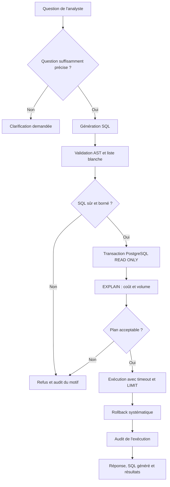
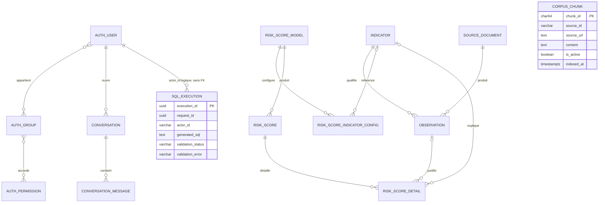

# C14 — Spécifications fonctionnelles de l’application

## 1. Objet du document

Ce document formalise les besoins fonctionnels démontrables de l’application d’analyse du surendettement à partir de l’implémentation présente dans le dépôt au commit `41c0ef1bd532c8caed3e2b795932740f0227ccf3` de `main`.

Le **problème métier** est l’étude statistique des évolutions du surendettement et de facteurs socio-économiques à l’échelle des territoires. L’**application web Django** gère les comptes, les sessions, les autorisations et les écrans de restitution. Les **services analytiques et d’IA** fournissent les scores territoriaux, les indicateurs, la recherche documentaire et l’interrogation SQL encadrée.

Le score affiché est un indicateur statistique territorial. Il ne constitue ni un diagnostic individuel, ni une décision concernant une personne ou un dossier de crédit. Cette limite est affichée dans `web/templates/home.html` et `web/templates/dashboard/methodology.html`.

## 2. Périmètre fonctionnel

### Dans le périmètre

- inscription avec activation différée, connexion, déconnexion et session Django ;
- rôles `viewer`, `analyst`, `administrator` et permissions associées ;
- validation, modification et suppression de comptes par un superuser ;
- dashboard protégé : filtres, score, couverture, facteurs, série temporelle et comparaisons ;
- carte territoriale et courbe d’évolution alimentées par des routes Django appelant le service analytique ;
- page de méthodologie et page de qualité réservée au superuser ;
- assistant d’information et assistant SQL, conversations persistées par utilisateur ;
- citations documentaires et références de données, SQL généré, résultat synthétisé, refus ou clarification ;
- feedback « utile / inutile » sur une réponse ;
- stockage des données opérationnelles, des scores, conversations, chunks documentaires et audits SQL.

### Hors périmètre

- décision individuelle de solvabilité, recommandation de crédit ou traitement d’un dossier personnel ;
- modification de données par l’assistant SQL : seules des lectures bornées sont acceptées ;
- administration fonctionnelle complète fondée sur le seul groupe `administrator` ;
- ingestion libre de documents non approuvés ;
- déclaration de conformité complète au RGAA ;
- application mobile ou interface hors des applications web présentes dans le dépôt.

### Limites actuelles

- le dashboard et les assistants dépendent de services HTTP et de PostgreSQL correctement configurés ;
- l’assistant refuse de produire une réponse documentaire sans preuve approuvée ;
- les anciennes tables RAG Django restent présentes pour compatibilité/audit mais sont dépréciées ; la source active est `assistant.corpus_chunks` ;
- `administrator` reçoit `manage_application`, mais les vues de gestion des comptes et de qualité contrôlent `is_superuser` : l’équivalence entre rôle applicatif et superuser n’est donc pas implémentée ;
- aucune recette utilisateur ni aucun audit complet d’accessibilité n’est attesté dans le dépôt.

## 3. Utilisateurs et rôles

| Rôle démontrable | Finalité | Actions principales | Restrictions |
|---|---|---|---|
| Visiteur non authentifié | Découvrir le service et demander un accès | Accueil, confidentialité, inscription, connexion | Aucun dashboard ni assistant |
| `viewer` | Consulter l’analyse territoriale | Dashboard, méthodologie, carte, assistant d’information | Assistant SQL interdit |
| `analyst` | Réaliser des analyses avancées | Droits du viewer et assistant SQL | Pas de gestion des comptes par le seul rôle |
| `administrator` | Porter les permissions applicatives d’administration | Droits analyste et permission `manage_application` | Les écrans d’administration métier exigent actuellement `is_superuser` |
| Superuser Django | Administrer l’instance | Valider/modifier/supprimer les comptes, consulter la qualité, administration Django | Statut technique distinct du groupe `administrator` |

Sources : `web/accounts/migrations/0001_initial_roles.py`, `web/accounts/services.py`, `web/accounts/views.py`, `web/dashboard/views.py`, `web/assistant/views.py`.

## 4. Inventaire des fonctionnalités

| ID | Fonctionnalité | Utilisateur | Description | Preuve dans le dépôt |
|---|---|---|---|---|
| AUTH-01 | Demande d’accès | Visiteur | Crée un compte inactif sans rôle, en attente d’approbation | `web/accounts/forms.py`, `web/accounts/views.py`, `web/accounts/tests.py` |
| AUTH-02 | Connexion/déconnexion | Utilisateur actif | Ouvre ou clôt une session Django | `web/config/urls.py`, `web/config/settings.py`, `web/templates/registration/login.html` |
| AUTH-03 | Contrôle d’accès | Utilisateur authentifié | Vérifie session et permissions `view_dashboard` / `use_analytics` | `web/dashboard/views.py`, `web/assistant/views.py`, `web/dashboard/tests.py` |
| ADMIN-01 | Gestion des comptes | Superuser | Approuve, attribue un rôle, modifie ou supprime un compte | `web/accounts/views.py`, `web/accounts/services.py`, `web/accounts/tests.py` |
| DASH-01 | Dashboard territorial | Viewer et plus | Affiche score, niveau, couverture, facteurs et évolution | `web/dashboard/views.py`, `web/templates/dashboard/index.html` |
| DASH-02 | Filtres et comparaisons | Viewer et plus | Filtre niveau, territoire, période, version ; compare périodes/modèles | `web/dashboard/forms.py`, `web/dashboard/views.py`, `web/analytics/client.py` |
| DASH-03 | Carte et indicateurs | Viewer et plus | Charge catalogue, données et contours, puis affiche carte et tendance | `web/dashboard/views.py`, `web/static/js/site.js`, `web/templates/dashboard/index.html` |
| DASH-04 | Méthodologie et qualité | Viewer / superuser | Explique le score ; expose le rapport qualité au superuser | `web/dashboard/views.py`, `web/templates/dashboard/methodology.html`, `web/templates/dashboard/data_quality.html` |
| AST-01 | Assistant d’information | Viewer et plus | Répond à une question métier avec preuves approuvées ou refuse | `web/assistant/views.py`, `assistant_api/orchestration.py`, `tests/test_assistant_api.py` |
| AST-02 | Conversations et citations | Viewer et plus | Persiste l’historique, la méthode, les sources et références de données | `web/assistant/models.py`, `web/assistant/views.py`, `web/assistant/test_views.py` |
| SQL-01 | Assistant SQL | Analyst et plus | Génère, valide et exécute une lecture SQL bornée | `web/assistant/views.py`, `assistant_api/sql_service.py`, `assistant_api/sql_validation.py` |
| SQL-02 | Refus/clarification et audit | Analyst et plus | Refuse les requêtes dangereuses ou ambiguës et trace l’exécution | `assistant_api/sql_validation.py`, `assistant_api/sql_service.py`, `assistant_api/migrations.py` |
| FB-01 | Feedback | Propriétaire de la conversation | Enregistre « utile » ou « inutile » sur une réponse | `web/assistant/views.py`, `web/assistant/models.py`, `web/assistant/test_views.py` |

## 5. User stories et spécifications fonctionnelles

### US-01 — Demander puis obtenir un accès

**Contexte**

L’application réserve ses fonctions analytiques aux comptes validés.

**Utilisateur / rôle**

Visiteur, puis superuser pour l’approbation.

**Besoin**

En tant que visiteur, je souhaite demander un compte afin d’accéder ultérieurement à l’application après validation.

**Préconditions**

Le visiteur n’est pas connecté ; son adresse électronique n’est pas déjà utilisée.

**Scénario nominal**

1. Le visiteur renseigne identifiant, adresse électronique et mot de passe.
2. L’application crée un compte inactif sans rôle et confirme la demande.
3. Un superuser sélectionne un rôle et approuve le compte.
4. Le compte devient actif et peut se connecter.

**Scénarios alternatifs / erreurs**

- Une adresse déjà enregistrée ou un formulaire invalide produit une erreur de validation.
- Un rôle inconnu est refusé.
- Un non-superuser reçoit un refus d’accès à la gestion.

**Critères d’acceptation**

- AC-01 Un compte issu de l’inscription est inactif et sans groupe.
- AC-02 Une approbation valide attribue exactement l’un des trois rôles et active le compte.
- AC-03 L’écran d’approbation est inaccessible à un non-superuser.

**Critères d’accessibilité**

- A11Y-01 Chaque champ possède un libellé programmatique (WCAG 2.2, 1.3.1 et 3.3.2 ; RGAA, formulaires).
- A11Y-02 Les erreurs sont identifiables et ne reposent pas seulement sur la couleur (WCAG 3.3.1) — à vérifier lors de la recette d’accessibilité.

**Références d’implémentation**

- `web/accounts/forms.py`
- `web/accounts/views.py`
- `web/accounts/tests.py`

### US-02 — Se connecter et se déconnecter

**Contexte**

Les pages analytiques nécessitent une session authentifiée.

**Utilisateur / rôle**

Utilisateur actif disposant d’un rôle.

**Besoin**

En tant qu’utilisateur autorisé, je souhaite ouvrir puis fermer ma session afin d’utiliser l’application de manière contrôlée.

**Préconditions**

Le compte est actif et les identifiants sont valides.

**Scénario nominal**

1. L’utilisateur saisit ses identifiants.
2. Django crée la session et redirige vers le dashboard.
3. L’utilisateur déclenche la déconnexion.
4. La session est clôturée et l’accueil est affiché.

**Scénarios alternatifs / erreurs**

- Des identifiants invalides affichent une alerte.
- Une page protégée demandée sans session redirige vers la connexion.
- Un compte sans permission reçoit une réponse d’interdiction.

**Critères d’acceptation**

- AC-01 Une connexion valide redirige vers `dashboard`.
- AC-02 Un visiteur ne consulte pas le dashboard.
- AC-03 Le bouton de déconnexion utilise une requête POST protégée par CSRF.

**Critères d’accessibilité**

- A11Y-01 L’erreur d’identification utilise `role="alert"` (WCAG 4.1.3).
- A11Y-02 La navigation et le contrôle de déconnexion sont utilisables au clavier (WCAG 2.1.1) — à vérifier en recette.

**Références d’implémentation**

- `web/config/urls.py`
- `web/templates/registration/login.html`
- `web/templates/base.html`
- `web/dashboard/tests.py`

### US-03 — Consulter et filtrer le dashboard

**Contexte**

Les données de surendettement et macro-économiques sont restituées comme indicateurs territoriaux.

**Utilisateur / rôle**

Viewer, analyst ou administrator disposant de `view_dashboard`.

**Besoin**

En tant que lecteur, je souhaite filtrer un territoire, une période et une version de modèle afin de consulter les résultats correspondants.

**Préconditions**

L’utilisateur est connecté et le service analytique est disponible.

**Scénario nominal**

1. L’utilisateur ouvre le dashboard.
2. L’application charge modèles et catalogue puis initialise les filtres.
3. L’utilisateur choisit niveau, territoire, période et version.
4. L’application récupère score, série, facteurs et observabilité.
5. Elle affiche score, niveau, couverture, facteurs et évolution.

**Scénarios alternatifs / erreurs**

- Un filtre invalide réaffiche le formulaire avec ses erreurs.
- Aucun résultat produit un état vide explicite.
- Une API indisponible produit une alerte stable sans détail technique distant.

**Critères d’acceptation**

- AC-01 Les filtres transmis correspondent aux valeurs validées du formulaire.
- AC-02 Les facteurs ne sont demandés que lorsqu’un score existe.
- AC-03 L’absence de résultat et l’indisponibilité du service sont distinguées.
- AC-04 Le score est présenté comme territorial, jamais individuel.

**Critères d’accessibilité**

- A11Y-01 Le formulaire possède un nom accessible et ses contrôles des libellés (WCAG 1.3.1, 3.3.2).
- A11Y-02 Les erreurs de service utilisent `role="alert"` (WCAG 4.1.3).
- A11Y-03 L’information des graphiques ne doit pas reposer uniquement sur la couleur (WCAG 1.4.1) — à vérifier en recette.

**Références d’implémentation**

- `web/dashboard/forms.py`
- `web/dashboard/views.py`
- `web/templates/dashboard/index.html`
- `web/analytics/tests.py`

### US-04 — Explorer la carte et la tendance territoriales

**Contexte**

Le dashboard complète les scores par des indicateurs cartographiés et une série temporelle.

**Utilisateur / rôle**

Viewer et rôles supérieurs.

**Besoin**

En tant que lecteur, je souhaite sélectionner un indicateur, une période et un territoire afin d’en observer la valeur et l’évolution.

**Préconditions**

Le catalogue, les données et les contours territoriaux sont accessibles.

**Scénario nominal**

1. Le navigateur charge le catalogue via la route Django protégée.
2. L’utilisateur choisit niveau, indicateur et période.
3. La carte affiche les territoires disposant d’une valeur.
4. Un clic ou les touches Entrée/Espace sélectionnent un territoire.
5. La synthèse et la courbe d’évolution sont recalculées.

**Scénarios alternatifs / erreurs**

- Une indisponibilité des données ou contours est annoncée dans la zone de statut.
- Moins de deux périodes produit un message explicatif, sans progression calculée.

**Critères d’acceptation**

- AC-01 Seuls les niveaux `department` et `region` sont acceptés pour les contours.
- AC-02 La carte affiche une position relative et non un diagnostic.
- AC-03 Les bornes temporelles pilotent la série affichée.

**Critères d’accessibilité**

- A11Y-01 Chaque territoire SVG est focalisable, possède `role="button"` et un nom accessible (WCAG 2.1.1 et 4.1.2).
- A11Y-02 La sélection fonctionne avec Entrée et Espace ; le focus visible est défini dans la feuille de style (WCAG 2.4.7/2.4.11).
- A11Y-03 Le statut dynamique utilise `role="status"` et `aria-live="polite"` (WCAG 4.1.3).
- A11Y-04 Contraste, ordre de focus et restitution du graphique par lecteur d’écran restent à vérifier en recette.

**Références d’implémentation**

- `web/dashboard/views.py`
- `web/templates/dashboard/index.html`
- `web/static/js/site.js`
- `web/static/css/site.css`

### US-05 — Consulter la méthodologie et la qualité

**Contexte**

L’interprétation du score exige une description de ses sources, pondérations et limites ; le suivi qualité est réservé à l’administration technique.

**Utilisateur / rôle**

Viewer pour la méthodologie ; superuser pour la qualité.

**Besoin**

En tant qu’utilisateur, je souhaite comprendre le calcul et ses limites afin d’interpréter correctement les résultats.

**Préconditions**

L’utilisateur est connecté et possède `view_dashboard` pour la méthodologie.

**Scénario nominal**

1. L’utilisateur ouvre la méthodologie.
2. L’application affiche modèle actif, indicateurs, pondérations, niveaux, sources et limites.
3. Un superuser peut ouvrir le rapport de qualité et ses alertes.

**Scénarios alternatifs / erreurs**

- L’indisponibilité de l’API est affichée comme alerte.
- Un non-superuser est refusé sur la page qualité.

**Critères d’acceptation**

- AC-01 La méthodologie rappelle que le score ne vise jamais une personne.
- AC-02 La qualité est inaccessible à un utilisateur non-superuser.
- AC-03 Les erreurs analytiques sont affichées sans masquer le reste du cadre de page.

**Critères d’accessibilité**

- A11Y-01 Le sommaire possède un nom accessible et les sections des titres associés (WCAG 1.3.1, 2.4.6).
- A11Y-02 Les alertes qualité sont exposées avec `role="alert"` ou `role="status"` selon leur nature (WCAG 4.1.3).

**Références d’implémentation**

- `web/dashboard/views.py`
- `web/templates/dashboard/methodology.html`
- `web/templates/dashboard/data_quality.html`
- `web/dashboard/tests.py`

### US-06 — Interroger l’assistant analytique avec des sources

**Contexte**

L’assistant répond à partir de sources documentaires approuvées et/ou de données analytiques structurées.

**Utilisateur / rôle**

Viewer et rôles supérieurs.

**Besoin**

En tant que lecteur, je souhaite poser une question métier afin d’obtenir une réponse traçable sans contenu inventé.

**Préconditions**

L’utilisateur possède `view_dashboard` ; l’API Assistant est configurée.

**Scénario nominal**

1. L’utilisateur saisit une question de 3 à 2 000 caractères.
2. Une conversation et le message utilisateur sont persistés.
3. L’API route la question vers la recherche documentaire, l’analyse structurée ou un traitement hybride.
4. La réponse, la méthode, la catégorie, les citations et références de données sont persistées.
5. L’utilisateur consulte la réponse et ses preuves.

**Scénarios alternatifs / erreurs**

- Sans preuve approuvée, l’assistant refuse d’inventer une réponse.
- Une erreur API affiche un message sûr ; le message utilisateur déjà créé reste dans la conversation.
- Un utilisateur ne peut pas ouvrir la conversation d’un autre.

**Critères d’acceptation**

- AC-01 Une réponse réussie conserve son identifiant de requête et sa méthode.
- AC-02 Chaque source affichée provient des citations retournées par l’API.
- AC-03 Une conversation est toujours filtrée par son propriétaire et son type.
- AC-04 L’absence de preuve déclenche un refus explicite.

**Critères d’accessibilité**

- A11Y-01 La zone de conversation est nommée et utilise `aria-live="polite"` (WCAG 4.1.3).
- A11Y-02 La question possède un libellé et le bouton d’envoi un nom accessible (WCAG 3.3.2, 4.1.2).
- A11Y-03 Les liens de sources doivent être compréhensibles hors contexte — à vérifier en recette (WCAG 2.4.4).

**Références d’implémentation**

- `web/assistant/forms.py`
- `web/assistant/views.py`
- `web/templates/assistant/conversations.html`
- `assistant_api/orchestration.py`
- `tests/test_assistant_api.py`

### US-07 — Retrouver ses conversations

**Contexte**

L’historique permet de reprendre une analyse sans exposer celle d’un autre compte.

**Utilisateur / rôle**

Utilisateur authentifié autorisé pour le type d’assistant.

**Besoin**

En tant qu’utilisateur, je souhaite retrouver mes conversations récentes afin de consulter les échanges persistés.

**Préconditions**

Au moins une conversation appartient à l’utilisateur.

**Scénario nominal**

1. L’application liste jusqu’à 20 conversations récentes du type choisi.
2. L’utilisateur en sélectionne une.
3. Les messages ordonnés sont affichés avec leurs métadonnées utiles.

**Scénarios alternatifs / erreurs**

- Un identifiant absent ou appartenant à autrui renvoie une page introuvable.
- Les historiques information et SQL restent séparés.

**Critères d’acceptation**

- AC-01 La liste est filtrée par utilisateur et par type.
- AC-02 Les messages sont ordonnés chronologiquement.
- AC-03 La rétention peut supprimer les conversations expirées via la commande prévue, en mode simulation par défaut.

**Critères d’accessibilité**

- A11Y-01 La liste latérale possède `aria-label="Conversations récentes"` et un titre (WCAG 1.3.1, 2.4.6).
- A11Y-02 L’état de conversation sélectionnée doit être perceptible autrement que par la couleur — à vérifier en recette (WCAG 1.4.1).

**Références d’implémentation**

- `web/assistant/models.py`
- `web/assistant/views.py`
- `web/templates/assistant/conversations.html`
- `web/assistant/test_retention.py`

### US-08 — Interroger l’assistant SQL en lecture seule

**Contexte**

Les analystes peuvent formuler en langage naturel une demande portant sur les vues analytiques autorisées.

**Utilisateur / rôle**

Analyst ou administrator disposant de `use_analytics`.

**Besoin**

En tant qu’analyste, je souhaite obtenir une analyse SQL bornée afin d’explorer les données sans pouvoir les modifier.

**Préconditions**

L’utilisateur possède `use_analytics`, le jeton interne et la connexion PostgreSQL read-only sont configurés.

**Scénario nominal**

1. L’utilisateur pose une question suffisamment précise.
2. Le service génère une requête candidate.
3. L’AST SQL est validé : requête unique, vues/colonnes/fonctions autorisées et `LIMIT` borné.
4. PostgreSQL exécute `EXPLAIN`, contrôle coût et volume estimés, puis exécute dans une transaction `READ ONLY` avec timeout.
5. La transaction est annulée, l’audit est persisté et l’interface affiche réponse, SQL généré et résultats disponibles.

**Scénarios alternatifs / erreurs**

- Une comparaison ambiguë demande indicateur et période avant toute génération.
- Une instruction d’écriture, une vue interdite, `SELECT *`, plusieurs instructions ou un `LIMIT` invalide est refusé.
- Un plan trop coûteux ou une configuration absente provoque une erreur contrôlée.

**Critères d’acceptation**

- AC-01 Un viewer ne peut pas ouvrir l’assistant SQL.
- AC-02 Seules les six vues de la liste blanche peuvent être interrogées.
- AC-03 Le résultat est limité à 200 lignes, trois jointures et cinq secondes d’exécution SQL.
- AC-04 La connexion exécute la transaction en lecture seule et effectue un rollback.
- AC-05 Acceptations et refus produisent un audit borné quand la base d’audit est disponible.

**Critères d’accessibilité**

- A11Y-01 Le mode « lecture seule » est exprimé par du texte, pas seulement par une apparence (WCAG 1.4.1).
- A11Y-02 Le SQL généré doit rester lisible au clavier et avec agrandissement à 200 % — à vérifier en recette (WCAG 1.4.4, 2.1.1).
- A11Y-03 Refus et clarifications doivent être annoncés comme messages dynamiques — à vérifier en recette (WCAG 4.1.3).

**Références d’implémentation**

- `web/assistant/views.py`
- `web/templates/assistant/conversations.html`
- `assistant_api/sql_service.py`
- `assistant_api/sql_validation.py`
- `assistant_api/sql_executor.py`
- `tests/test_sql_validation.py`

### US-09 — Évaluer une réponse

**Contexte**

L’utilisateur peut qualifier l’utilité d’une réponse persistée.

**Utilisateur / rôle**

Propriétaire de la conversation.

**Besoin**

En tant qu’utilisateur, je souhaite indiquer si une réponse est utile afin de conserver un retour associé à cette réponse.

**Préconditions**

La réponse assistant existe et appartient à une conversation de l’utilisateur.

**Scénario nominal**

1. L’utilisateur choisit « utile » ou « inutile ».
2. L’application vérifie propriété et rôle du message.
3. Elle enregistre la valeur et revient à la conversation appropriée.

**Scénarios alternatifs / erreurs**

- Une valeur différente des deux choix est ignorée.
- Un message utilisateur ou appartenant à autrui n’est pas accessible.

**Critères d’acceptation**

- AC-01 Seules les valeurs `useful` et `not_useful` sont persistées.
- AC-02 Le feedback ne porte que sur un message assistant appartenant au compte connecté.
- AC-03 Le retour conserve le type information ou SQL de la conversation.

**Critères d’accessibilité**

- A11Y-01 Le formulaire possède le nom accessible « Évaluer cette réponse » (WCAG 4.1.2).
- A11Y-02 L’état sélectionné et la confirmation du feedback doivent être perceptibles par technologie d’assistance — à vérifier en recette (WCAG 4.1.3).

**Références d’implémentation**

- `web/assistant/models.py`
- `web/assistant/views.py`
- `web/templates/assistant/conversations.html`
- `web/assistant/test_views.py`

### US-10 — Administrer les comptes sans supprimer le dernier superuser

**Contexte**

L’accès à l’application et la continuité de son administration exigent une gestion contrôlée des comptes.

**Utilisateur / rôle**

Superuser Django.

**Besoin**

En tant que superuser, je souhaite modifier ou supprimer des comptes afin de maintenir les accès sans rendre l’administration impossible.

**Préconditions**

Le superuser est authentifié ; le compte cible existe.

**Scénario nominal**

1. Le superuser ouvre la liste des comptes.
2. Il modifie identité, état, attributs Django ou rôle, ou demande une suppression.
3. L’application vérifie les garde-fous puis enregistre l’action.
4. Une suppression efface aussi les conversations et anonymise l’`actor_id` des audits SQL conservés.

**Scénarios alternatifs / erreurs**

- Le compte connecté ne peut pas se supprimer lui-même.
- Le dernier superuser actif ne peut être désactivé, rétrogradé ou supprimé.
- Un non-superuser reçoit un refus.

**Critères d’acceptation**

- AC-01 Les garde-fous maintiennent au moins un superuser actif.
- AC-02 La suppression d’un utilisateur entraîne celle de ses conversations par cascade.
- AC-03 L’audit SQL est conservé avec `actor_id = NULL` lorsqu’il existe.

**Critères d’accessibilité**

- A11Y-01 L’action destructive présente une page de confirmation et une alerte explicite (WCAG 3.3.4).
- A11Y-02 Le sélecteur de rôle d’une demande possède un libellé masqué visuellement mais accessible (WCAG 1.3.1, 3.3.2).
- A11Y-03 La cohérence de focus après modification/suppression reste à vérifier en recette.

**Références d’implémentation**

- `web/accounts/forms.py`
- `web/accounts/services.py`
- `web/accounts/views.py`
- `web/templates/accounts/delete_account.html`
- `web/accounts/tests.py`

## 6. Référentiel et exigences d’accessibilité

Les critères ci-dessus constituent des **objectifs d’accessibilité intégrés aux spécifications fonctionnelles**, en référence au **RGAA 4** et aux **WCAG 2.2 niveau AA**. Ils ne constituent pas une déclaration de conformité complète au RGAA : aucun audit exhaustif n’est présent dans le dépôt.

| Exigence | Fonctions concernées | Preuve existante | Statut |
|---|---|---|---|
| Structure sémantique et titres | Tous les écrans | `<main>`, `<nav>`, `<h1>`, `<h2>` dans `web/templates/base.html` et les templates métier | Implémentation partielle prouvée ; hiérarchie complète à recetter |
| Libellés de formulaires | Connexion, inscription, filtres, assistants, administration | Labels Django ; labels explicites dans `web/templates/dashboard/index.html` et `web/templates/accounts/access_requests.html` | Présent ; association complète à vérifier |
| Nom accessible des commandes | Navigation, envoi, feedback, carte | `aria-label`, texte de bouton et `role="button"` dans les templates et `web/static/js/site.js` | Présent sur les éléments audités |
| Messages et contenu dynamique | Erreurs, messages Django, assistant, carte | `role="alert"`, `role="status"`, `aria-live="polite"` | Présent ; comportement lecteur d’écran à vérifier |
| Navigation clavier et focus | Navigation et carte | `:focus-visible`, `tabindex="0"`, gestion Entrée/Espace | Présent pour la carte ; parcours complet à vérifier |
| Information non fondée sur la couleur | Carte, graphiques, alertes | Valeurs textuelles, légende et statut de carte | Partiel ; à vérifier lors de la recette d’accessibilité |
| Contrastes et redimensionnement | Tous les écrans | Non démontrables par inspection fonctionnelle seule | À mesurer lors de la recette d’accessibilité |
| Alternatives aux visualisations | Carte et courbes | Noms accessibles et texte de synthèse | Partiel ; équivalence complète à vérifier |

## 7. Parcours utilisateurs

### Parcours 1 — Authentification et accès au dashboard

### Parcours 2 — Analyse via le dashboard

### Parcours 3 — Assistant analytique

### Parcours 4 — Assistant SQL

## 8. Modèle de données

Le modèle fonctionnel ci-dessous distingue le schéma `public` utilisé par Django et les données opérationnelles du schéma `assistant` possédé par l’API Assistant. Les vues `analytics_*` sont des interfaces de lecture dérivées et ne sont pas représentées comme entités persistées.

| Entité | Finalité | Principaux champs | Relations | Source |
|---|---|---|---|---|
| `AUTH_USER` | Compte et authentification | identifiant, email, état, attributs staff/superuser | N–N groupes ; 1–N conversations | Django ; `web/config/settings.py` |
| `AUTH_GROUP` / `AUTH_PERMISSION` | Rôles et droits | nom, codename | N–N utilisateurs et permissions | `web/accounts/migrations/0001_initial_roles.py` |
| `CONVERSATION` | Historique d’un assistant | utilisateur, titre, type, dates | utilisateur 1–N ; messages 1–N | `web/assistant/models.py`, migration `0003_conversations.py` |
| `CONVERSATION_MESSAGE` | Question ou réponse persistée | rôle, contenu, méthode, citations, SQL, feedback, métadonnées | N–1 conversation | `web/assistant/models.py`, migrations `0003` et `0004` |
| `SOURCE_DOCUMENT` | Provenance d’une publication collectée | URL, empreinte, période, statut d’extraction | 1–N observations | `src/storage/models.py` |
| `INDICATOR` | Catalogue des indicateurs | code, libellé, catégorie, unité | observations, configurations et détails | `src/storage/models.py` |
| `OBSERVATION` | Valeur territoriale normalisée | géographie, période, valeur, unité, confiance | document et indicateur ; détail de score facultatif | `src/storage/models.py` |
| `RISK_SCORE_MODEL` | Version du modèle territorial | code, version, statut actif, seuils | configurations et scores | `src/storage/models.py` |
| `RISK_SCORE_INDICATOR_CONFIG` | Paramétrage d’un indicateur | code, poids, direction, normalisation | modèle ; indicateur facultatif | `src/storage/models.py` |
| `RISK_SCORE` | Score par territoire/période | niveau, code, période, score, couverture | modèle ; détails | `src/storage/models.py` |
| `RISK_SCORE_DETAIL` | Contribution explicative | valeur brute, poids, contribution, source | score ; indicateur/observation facultatifs | `src/storage/models.py` |
| `assistant.corpus_chunks` | Corpus documentaire actif | provenance, contenu, empreintes, index de recherche | aucune FK interservice | `assistant_api/migrations.py`, `assistant_api/repository.py` |
| `assistant.sql_executions` | Audit borné des requêtes SQL | requête, décision, erreur, durée, volume, coût | `actor_id` textuel, sans FK | `assistant_api/migrations.py`, `assistant_api/repository.py` |

Les anciennes entités `RagSource`, `RagDocument`, `RagDocumentVersion`, `RagChunk` et `RagIndexRun` existent dans `web/assistant/models.py`, mais `database-doc/mapping/models-to-tables.md` et les migrations `0002`/`0005` les déclarent dépréciées. Elles ne sont donc pas présentées comme le modèle actif de l’assistant.

## 9. Matrice de traçabilité

| Besoin | User story | Fonction / écran | Données | Test ou preuve | Fichier |
|---|---|---|---|---|---|
| Accès contrôlé | US-01, US-02 | Inscription, connexion | User, Group, session | Tests inscription et redirection | `web/accounts/tests.py`, `web/dashboard/tests.py` |
| Consultation territoriale | US-03 | Dashboard | scores, facteurs, modèles | Gestion API indisponible et accès viewer | `web/dashboard/tests.py` |
| Exploration cartographique | US-04 | Carte et courbe | indicateurs territoriaux, GeoJSON | Code d’interaction et routes protégées | `web/static/js/site.js`, `web/dashboard/views.py` |
| Compréhension du score | US-05 | Méthodologie | modèle, indicateurs, sources | Accès avec permission testé | `web/dashboard/tests.py` |
| Suivi qualité | US-05 | Qualité | observabilité analytique | Réservation au superuser testée | `web/dashboard/tests.py` |
| Réponse analytique traçable | US-06 | Assistant information | conversation, messages, citations | Réponse persistée avec provenance | `web/assistant/test_views.py` |
| Protection des conversations | US-07 | Historique | conversation, messages | Accès à la conversation d’autrui refusé | `web/assistant/test_views.py` |
| Analyse SQL sûre | US-08 | Assistant SQL | vues analytiques, audit SQL | Validation, read-only, coût, rollback | `tests/test_sql_validation.py`, `tests/test_sql_executor.py` |
| Clarification/refus | US-06, US-08 | Réponse assistant | décision, erreur de validation | Cas ambigus et dangereux testés | `tests/test_assistant_api.py`, `tests/test_sql_service.py` |
| Retour utilisateur | US-09 | Feedback | message.feedback | Persistance et propriété testées | `web/assistant/test_views.py` |
| Administration des accès | US-10 | Gestion des comptes | User, Group, audits | Garde-fous superuser testés | `web/accounts/tests.py` |

## 10. Preuves à capturer pour le rapport

Les captures suivantes doivent être réalisées manuellement sur une instance configurée ; aucune fausse capture n’est intégrée ici.

| Capture | Ce qu’elle doit montrer | Contribution à C14 |
|---|---|---|
| Connexion | Champs libellés et erreur d’identifiants | Parcours d’authentification, critères d’acceptation et accessibilité |
| Demande d’accès | Formulaire puis confirmation de demande | Besoin et scénario US-01 |
| Dashboard connecté | Identité connectée, score territorial et avertissement de portée | Fonction réelle et absence de décision individuelle |
| Filtres et comparaison | Niveau, territoire, période, modèle et résultats associés | Scénario US-03 |
| Carte territoriale | Contrôles, légende, statut, territoire sélectionné et courbe | Parcours dashboard et accessibilité dynamique |
| Méthodologie | Pondérations, sources et limites d’interprétation | Contexte fonctionnel et critères de validation |
| Assistant analytique | Question, réponse et sources/références | Parcours assistant et traçabilité |
| Refus sans preuve | Message de refus réel obtenu sur l’instance | Scénario alternatif US-06 |
| Assistant SQL | Badge lecture seule, SQL généré et résultat | Parcours SQL et critères de sécurité |
| Clarification ou refus SQL | Demande ambiguë ou dangereuse et message retourné | Validation/refus US-08 |
| Historique | Liste personnelle et messages d’une conversation | Persistance et parcours US-07 |
| Feedback | Commandes utile/inutile et état après soumission | Critères US-09 |
| Contrôle d’accès | Viewer refusé sur l’assistant SQL ou non-superuser refusé en administration | Rôles et autorisations |
| Qualité | Alertes, couverture et fraîcheur sur la page superuser | Fonction d’administration et preuves de restitution |

## 11. Matrice C14 RNCP

| Critère C14 | Élément produit | Preuve |
|---|---|---|
| 1. Modèle de données formalisé | Diagramme Mermaid `erDiagram`, distinction `public` / `assistant` et dictionnaire synthétique | Section 8 ; `src/storage/models.py`, `web/assistant/models.py`, `assistant_api/migrations.py` |
| 2. Parcours utilisateurs modélisés | Quatre diagrammes fonctionnels : authentification, dashboard, assistant analytique et SQL | Section 7 ; routes, vues et clients cités |
| 3. Spécifications comprenant contexte, scénarios et critères de validation | Dix user stories avec rôle, besoin, préconditions, scénarios nominaux/alternatifs et critères testables | Section 5 et matrice de traçabilité section 9 |
| 4. Accessibilité intégrée aux critères d’acceptation | Bloc A11Y propre à chaque user story concernée | Section 5 ; preuves HTML/CSS/JS |
| 5. Référence à un standard d’accessibilité | Références explicites au RGAA 4 et aux WCAG 2.2 niveau AA, sans revendication de conformité | Section 6 |

### Éléments non démontrables par le dépôt seul

- conformité RGAA globale, niveau de conformité WCAG AA, contrastes mesurés et tests avec technologies d’assistance ;
- résultats d’une recette ou de tests utilisateurs réels ;
- identité détaillée de personas métier ou exigences attribuées à Sofinco ;
- disponibilité effective des données et services dans un environnement de soutenance sans exécution de cet environnement ;
- administration par le groupe `administrator` sans attribution parallèle de `is_superuser` ;
- équivalence complète en texte/tabulaire de toutes les informations portées par les visualisations.
