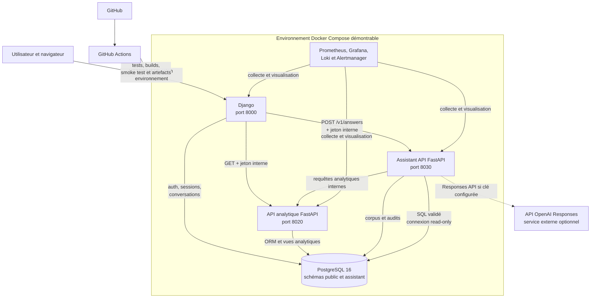
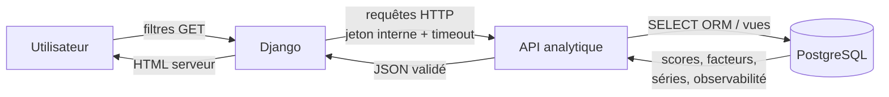
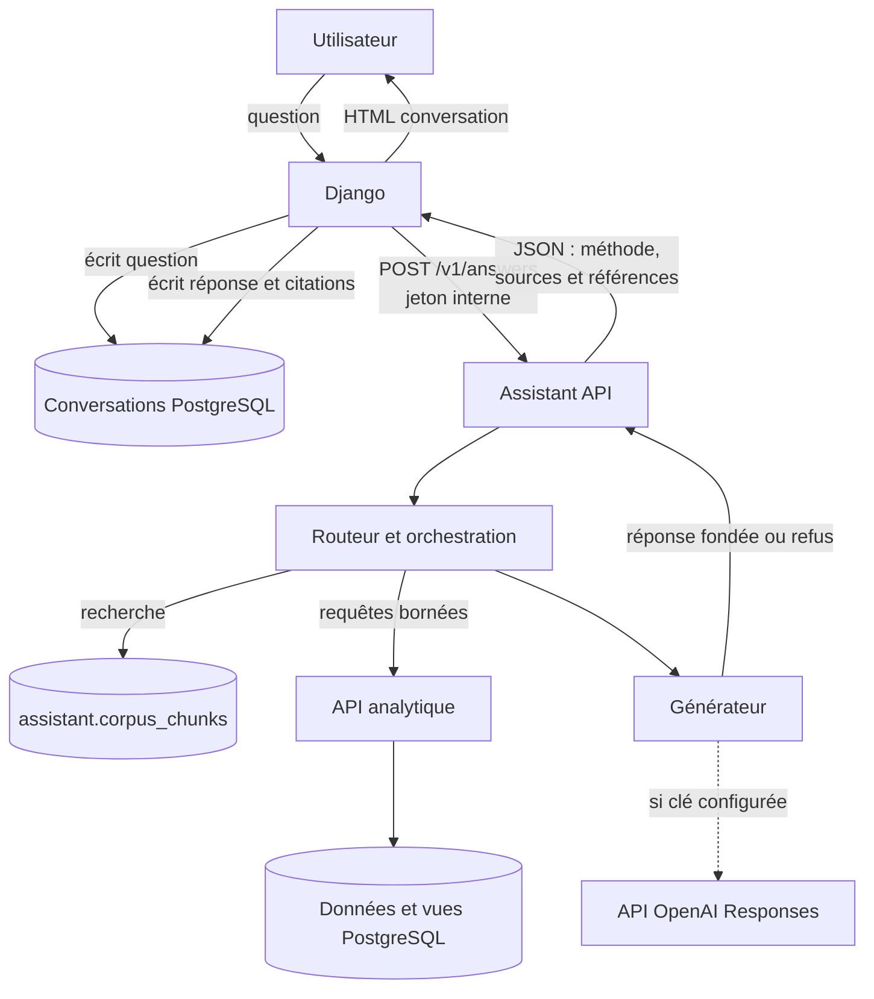
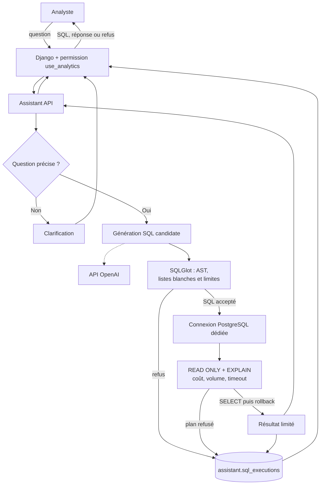
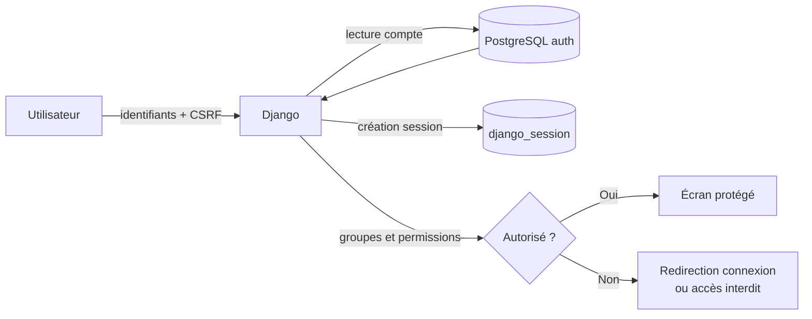

# C15 — Conception technique et faisabilité

## 1. Objet du document

Ce document formalise la conception technique réellement implémentée de l’application d’analyse du surendettement, de ses services analytiques et de son service d’intelligence artificielle. Il évalue ensuite la faisabilité technique de sa démonstration et de la poursuite de son développement.

L’audit porte sur `main` au commit `41c0ef1bd532c8caed3e2b795932740f0227ccf3`. Les affirmations ci-dessous sont rattachées à des fichiers du dépôt. Un composant prévu mais non prouvé en fonctionnement externe est présenté comme tel.

## 2. Périmètre technique

| Sous-ensemble | Périmètre réellement observé | Hors périmètre ou limite |
|---|---|---|
| Interface web | Templates Django, HTML, CSS et JavaScript ; formulaires, carte SVG et conversations | Aucun client mobile natif |
| Backend web | Django : authentification, sessions, permissions, rendu serveur et persistance des conversations | Le serveur de production WSGI n’est pas défini ; l’image lance `runserver` |
| Service analytique | API FastAPI : données, scores territoriaux, facteurs, séries et observabilité | Ce service n’est pas le service génératif |
| Service Assistant / IA | API FastAPI autonome : routage, RAG, analyse structurée, génération et Text-to-SQL | Génération réelle dépendante d’un fournisseur externe configuré |
| Données | PostgreSQL, schémas `public` et `assistant`, ORM Django/SQLAlchemy, vues analytiques | Des chemins SQLite historiques restent utilisés par certaines pipelines |
| Validation | Contrats Pydantic, validation des réponses côté Django, SQLGlot, liste blanche et contrôles de coût | La qualité sémantique générative nécessite une recette réelle |
| Exécution | Images multi-cibles Docker et assemblage Docker Compose | Aucun orchestrateur cloud ou hébergeur cible prouvé |
| CI | GitHub Actions, contrôles statiques, audits, tests, migrations, builds et smoke test | Aucun déploiement automatique ; aucune préproduction externe attestée |

L’**application** désigne ici l’interface Django et le service analytique qu’elle consomme. Le **service IA** désigne l’Assistant API, son orchestration et son appel éventuel à l’API OpenAI. Cette séparation est matérialisée par des processus, images et ports distincts dans `docker/Dockerfile` et `docker/compose.yaml`.

## 3. Architecture générale

Le diagramme représente des appels visibles dans le code et Compose. Il ne signifie pas qu’un environnement public est actuellement déployé.

| Composant | Responsabilité | Technologie | Preuve |
|---|---|---|---|
| Navigateur | Affichage et interactions | HTML, CSS, JavaScript, SVG | `web/templates/`, `web/static/` |
| Django | Comptes, sessions, permissions, rendu, conversations et clients internes | Django 5.2.17 | `web/config/settings.py`, `web/config/urls.py`, `web/requirements.txt` |
| API analytique | Publication des données, scores, facteurs et observabilité | FastAPI, Pydantic, SQLAlchemy | `app/main.py`, `app/views/`, `requirements.txt` |
| Assistant API | Routage, grounding, génération, SQL avancé et métriques | FastAPI, Pydantic, SQLGlot | `assistant_api/main.py`, `assistant_api/orchestration.py`, `assistant_api/requirements.txt` |
| Adaptateur OpenAI | Appel de l’API Responses pour la génération | HTTP `requests` | `assistant_api/openai_provider.py` |
| PostgreSQL | Stockage relationnel, sessions, données, conversations, corpus et audits | PostgreSQL 16 Alpine | `docker/compose.yaml`, `database-doc/inventory/databases.md` |
| Validation SQL | Analyse AST, listes blanches, limites et validation du plan | SQLGlot, PostgreSQL `EXPLAIN` | `assistant_api/sql_validation.py`, `assistant_api/sql_executor.py` |
| Observabilité | Métriques, journaux, tableaux de bord et alertes | Prometheus, Grafana, Loki, Promtail, Alertmanager | `docker/compose.yaml`, `docker/monitoring/` |
| Conteneurisation | Images dédiées et assemblage des services | Docker, Docker Compose | `docker/Dockerfile`, `docker/compose.yaml` |
| Intégration continue | Validation reproductible et packaging de l’Assistant API | GitHub Actions | `.github/workflows/ci.yml`, `docker/run_ci.sh` |

## 4. Stack technique

| Technologie | Usage | Version / contrainte | Justification liée au projet | Source |
|---|---|---|---|---|
| Python | Langage commun aux applications, pipelines et tests | 3.12 dans Docker, Ruff et CI | Mutualise modèles, services, traitements et tests | `docker/Dockerfile`, `pyproject.toml`, `.github/workflows/ci.yml` |
| Django | Application web rendue côté serveur | 5.2.17 | Fournit authentification, sessions, permissions, formulaires et ORM déjà utilisés | `web/requirements.txt`, `web/config/settings.py` |
| FastAPI | APIs analytique et Assistant | 0.141.1 | Sépare les contrats HTTP spécialisés de l’interface web | `requirements.txt`, `assistant_api/requirements.txt`, `app/main.py` |
| Pydantic | Validation des contrats API et configuration | 2.13.4 pour l’Assistant ; `pydantic-settings` 2.7.1 | Borne les entrées/sorties et produit des schémas OpenAPI | `assistant_api/requirements.txt`, `assistant_api/schemas.py`, `requirements.txt` |
| PostgreSQL | Base applicative et analytique | image `postgres:16-alpine` | Transactions, contraintes, recherche plein texte, vues et mode read-only | `docker/compose.yaml`, `assistant_api/migrations.py` |
| psycopg | Pilote PostgreSQL | 3.2.3 | Connecte Django et SQLAlchemy à PostgreSQL | `web/requirements.txt`, `assistant_api/requirements.txt` |
| SQLAlchemy | ORM et couche SQL des données/services | 2.0.32 | Modèles opérationnels, connexions et requêtes explicites | `requirements.txt`, `src/storage/models.py`, `assistant_api/repository.py` |
| SQLGlot | Analyse de la requête SQL candidate | 26.33.0 | Permet une validation AST avant tout accès à la base | `assistant_api/requirements.txt`, `assistant_api/sql_validation.py` |
| OpenAI Responses API | Génération de texte et SQL encadrée | Modèle configurable ; défaut `gpt-5.6-terra` dans le code audité | Le modèle reçoit un contexte préparé et n’accède pas directement à la base | `assistant_api/openai_provider.py`, `docker/compose.yaml` |
| Uvicorn | Serveur ASGI des deux APIs | 0.34.0 | Lance les applications FastAPI dans leurs images | `requirements.txt`, `assistant_api/requirements.txt`, `docker/Dockerfile` |
| HTML/CSS/JavaScript | Interface et visualisations sans framework client | Pas de version applicable | Rendu Django simple et interactions ciblées côté navigateur | `web/templates/`, `web/static/` |
| Docker | Construction des runtimes | Version non fixée | Images reproductibles séparées par responsabilité | `docker/Dockerfile` |
| Docker Compose | Orchestration locale/CI | Version non fixée | Décrit dépendances, réseaux implicites, volumes et healthchecks | `docker/compose*.yaml` |
| GitHub Actions | CI et production d’artefacts | Actions `checkout@v4`, `setup-python@v5`, `upload-artifact@v4` | Automatise la validation à chaque push/PR et sur demande | `.github/workflows/ci.yml` |
| pytest | Tests Python | 9.0.3 | Couvre unités, APIs, orchestration, données et SQL | `requirements.txt`, `pyproject.toml`, `tests/`, `app/tests/` |
| Ruff / mypy / Bandit / pip-audit | Qualité, typage, sécurité et dépendances | 0.11.13 / 1.16.1 / 1.8.5 / 2.9.0 | Détecte des défauts avant packaging | `requirements-ci.txt`, `docker/run_ci.sh` |
| Streamlit | Interface analytique historique complémentaire | 1.54.0 | Une image et un service restent disponibles, mais Django constitue l’application web documentée pour E4 | `requirements.txt`, `app.py`, `docker/compose.yaml` |

Les versions « Docker », « Docker Compose » et « GitHub » ne sont pas fixées par le dépôt. Il serait incorrect de leur attribuer une version supposée.

## 5. Environnements d’exécution

| Environnement | Objectif | Services | Configuration | Preuve |
|---|---|---|---|---|
| Développement local Python | Développer ou tester un composant | Django, APIs ou Streamlit lancés séparément | Variables locales et dépendances Python | `README.md`, `web/README.md` |
| Développement Compose | Rechargement du code et serveur Django de développement | API avec reload, Django, PostgreSQL et services de base | Overlay `compose.development.yaml` | `docker/compose.yaml`, `docker/compose.development.yaml` |
| Démonstration locale Compose | POC intégré reproductible | PostgreSQL, API, Assistant API, Django ; Streamlit et supervision disponibles | Fichier `.env` local non versionné, images multi-cibles | `docker/compose.yaml`, `docker/Dockerfile` |
| Tests locaux reproductibles | Rejouer la chaîne de validation | Conteneur CI et PostgreSQL jetable | `requirements-ci.txt` puis script CI | `docker/CI.md`, `docker/run_ci.sh` |
| CI GitHub Actions | Valider push, PR ou déclenchement manuel | Docker Compose, tests, build et smoke test Assistant | Secrets de CI non productifs ; clé OpenAI vide | `.github/workflows/ci.yml` |
| Staging prévu | Positionner `APP_ENV=staging` | PostgreSQL, API, Streamlit, Django | Overlay très limité ; aucune URL externe | `docker/compose.staging.yaml` |
| Production prévue | Politique de redémarrage et healthchecks | PostgreSQL, API, Streamlit, Django | Overlay et checklist ; validation cible à faire | `docker/compose.production.yaml`, `docker/PRODUCTION_CHECKLIST.md` |
| Préproduction externe | Non démontrée | Aucun service public prouvé | Aucun manifeste d’hébergeur (`render.yaml` absent) | Absence de configuration de déploiement ; `docker/CI.md` |

La CI ne déploie rien : elle construit et publie des **artefacts GitHub Actions temporaires**, pas une application accessible. Le POC recevable est donc l’environnement Docker Compose local, sous réserve de configuration.

## 6. Dépendances et configuration

### Dépendances entre services

- Django dépend de PostgreSQL, de l’API analytique et de l’Assistant API.
- L’Assistant API dépend de PostgreSQL et appelle l’API analytique pour les données structurées.
- L’Assistant API appelle l’API OpenAI uniquement lorsqu’une clé est fournie.
- Le chemin SQL utilise une connexion PostgreSQL dédiée configurée en lecture seule.
- La supervision collecte les métriques et journaux des services, sans participer aux réponses métier.

### Variables et services externes principaux

| Variable / dépendance | Composant | Finalité | Obligatoire | Sensibilité |
|---|---|---|---|---|
| `DATABASE_URL` | Django et stockage | Connexion PostgreSQL principale | Oui pour Django | Secret de connexion |
| `ANALYTICS_DATABASE_URL` | API analytique | Entrepôt PostgreSQL analytique | Requis pour le chemin PostgreSQL ; fallback historique possible selon composant | Secret de connexion |
| `ASSISTANT_DATABASE_URL` | Assistant API | Corpus, migrations et audits | Oui pour l’Assistant opérationnel | Secret de connexion |
| `ANALYTICS_READONLY_DATABASE_URL` | Assistant SQL | Connexion SQL dédiée read-only | Oui pour le mode SQL | Secret de connexion |
| `DJANGO_SECRET_KEY` | Django | Signature cryptographique Django | Oui | Secret critique |
| `DJANGO_DEBUG` | Django | Mode debug | Non ; doit être faux hors développement | Non secret |
| `DJANGO_ALLOWED_HOSTS` | Django | Hôtes acceptés | Oui hors valeurs locales | Configuration de sécurité |
| `DJANGO_CSRF_TRUSTED_ORIGINS` | Django | Origines HTTPS de confiance | Selon déploiement | Configuration de sécurité |
| `DJANGO_SECURE_COOKIES` | Django | Cookies session et CSRF sécurisés | Recommandé hors local | Non secret |
| `DJANGO_SECURE_SSL_REDIRECT` | Django | Redirection HTTPS | Selon terminaison TLS | Non secret |
| `DJANGO_HSTS_SECONDS` | Django | Activation progressive HSTS | Selon production | Non secret |
| `ASSISTANT_INTERNAL_TOKEN` | Django et APIs | Authentification des appels internes | Oui pour routes protégées | Secret critique |
| `ANALYTICS_API_BASE_URL` | Django / Assistant | Adresse de l’API analytique | Oui hors défaut local/Compose | Non secret |
| `ASSISTANT_API_BASE_URL` | Django | Adresse de l’Assistant API | Oui hors défaut local/Compose | Non secret |
| `ANALYTICS_API_TIMEOUT_SECONDS` | Django | Timeout analytique | Non, défaut 5 s | Non secret |
| `ASSISTANT_API_TIMEOUT_SECONDS` | Django | Timeout Assistant | Non, défaut 90 s | Non secret |
| `OPENAI_API_KEY` | Assistant API | Authentification API OpenAI | Oui pour génération réelle | Secret critique |
| `OPENAI_MODEL` | Assistant API | Modèle utilisé | Non, valeur par défaut définie | Non secret |
| `POSTGRES_DB`, `POSTGRES_USER`, `POSTGRES_PASSWORD` | Compose | Initialisation PostgreSQL | Mot de passe obligatoire | Identifiants sensibles |
| `GRAFANA_ADMIN_PASSWORD` | Grafana | Compte administrateur | Oui dans Compose | Secret critique |
| API OpenAI | Assistant API | Service de génération externe | Selon fonctions démontrées | Dépendance réseau et fournisseur |
| Contours data.gouv.fr | Dashboard | GeoJSON des départements/régions | Pour la carte | Dépendance réseau publique |

Sources : `web/config/settings.py`, `app/core/config.py`, `assistant_api/storage.py`, `assistant_api/openai_provider.py`, `docker/compose.yaml`. Aucune valeur réelle de secret n’est reproduite.

## 7. Flux de données

### Flux 1 — Consultation du dashboard

- **Entrées :** niveau géographique, territoire, période et version du modèle.
- **Sorties :** score territorial, couverture, facteurs, séries et comparaisons.
- **Contrôles :** session, permission `view_dashboard`, validation du formulaire, contrat de réponse et timeout.
- **Écritures :** aucune écriture métier déclenchée par la consultation.
- **Appel externe :** les contours cartographiques sont récupérés auprès de data.gouv.fr et mis en cache par Django (`web/dashboard/views.py`).

### Flux 2 — Assistant analytique

- **Entrée :** question de 3 à 2 000 caractères, mode, identifiant d’acteur et conversation facultative.
- **Sortie :** réponse, décision, méthode, catégorie, sources, références de données et identifiant de requête.
- **Contrôles :** authentification interne, contrat Pydantic, routage, corpus approuvé et refus sans preuve.
- **Écritures :** messages/citations dans Django ; lecture du corpus actif.
- **Appel externe :** API OpenAI si `OPENAI_API_KEY` est configurée ; sinon générateur indisponible normalisé.

### Flux 3 — Assistant SQL

- **Entrée :** question naturelle réservée au rôle disposant de `use_analytics`.
- **Sortie :** réponse, SQL généré, lignes bornées, identifiant d’exécution ou clarification/refus.
- **Contrôles :** une instruction, lecture seulement, six vues autorisées, fonctions/colonnes autorisées, `LIMIT` de 1 à 200, trois jointures maximum, plan ≤ 100 000, estimation ≤ 1 000 000 lignes et timeout de 5 s.
- **Écritures :** audit SQL uniquement ; aucun changement dans les données analysées.
- **Séparation :** le LLM propose du texte SQL ; seul le validateur puis l’exécuteur read-only accèdent au chemin base.

### Flux 4 — Authentification

- **Entrées :** identifiant et mot de passe.
- **Sorties :** session, redirection ou refus.
- **Contrôles :** middleware CSRF/session/authentification, état actif, décorateurs `login_required` et `permission_required`.
- **Écritures :** session Django et éventuels messages applicatifs.

## 8. Choix techniques et justification

| Choix | Usage réel et justification | Compromis observé |
|---|---|---|
| Django rendu serveur | Centralise comptes, sessions, permissions, CSRF, formulaires et templates sans imposer une SPA | `runserver` reste utilisé dans l’image ; un serveur WSGI de production devra être choisi |
| Deux services FastAPI | Isole publication analytique et orchestration IA, avec contrats OpenAPI et cycles de test distincts | Trois processus applicatifs et leurs configurations doivent rester cohérents |
| PostgreSQL partagé avec responsabilités logiques | Offre contraintes, transactions, recherche plein texte, vues et comptes read-only ; schéma `assistant` séparé | Une panne de l’instance affecte plusieurs services ; sauvegarde/restauration indispensables |
| SQLAlchemy et Django ORM | Chaque service utilise la couche adaptée à son périmètre ; SQL explicite pour migrations et audits Assistant | Plusieurs mécanismes de migration exigent une documentation rigoureuse |
| SQLGlot avant PostgreSQL | L’AST permet de refuser constructions, tables, colonnes ou fonctions non autorisées avant connexion | La validation doit évoluer avec les vues et le dialecte PostgreSQL |
| Connexion SQL read-only dédiée | Défense supplémentaire au-delà de la validation syntaxique | Nécessite un compte et une URL correctement provisionnés |
| API OpenAI derrière un adaptateur | Le fournisseur ne reçoit qu’un prompt préparé ; erreurs distantes et clé sont encapsulées | Disponibilité, coût, latence et comportement du modèle restent externes |
| Docker multi-cibles | Réutilise une base commune tout en produisant des images API, Django, Assistant et CI | L’image runtime générale installe plus de dépendances que chaque service n’en utilise |
| GitHub Actions sans clé OpenAI | Rend les validations déterministes et évite un secret fournisseur dans la CI | La génération réelle n’est pas couverte automatiquement |
| Contrats validés côté clients Django | Empêche une réponse API mal formée d’être directement rendue | Une évolution d’API implique de synchroniser contrat et client |

## 9. Sécurité architecturale

- Django applique authentification, sessions, CSRF, permissions et validateurs de mot de passe (`web/config/settings.py`, `web/dashboard/views.py`, `web/assistant/views.py`).
- Les appels internes utilisent l’en-tête `X-Internal-Token` comparé en temps constant (`assistant_api/auth.py`).
- Les secrets sont injectés par variables d’environnement et ne doivent pas être écrits dans le dépôt (`docker/compose.yaml`, `web/README.md`).
- Les clients HTTP imposent des timeouts et convertissent les erreurs distantes en messages stables (`web/analytics/client.py`, `web/assistant/client.py`).
- Le SQL avancé passe par AST, listes blanches, limites, `EXPLAIN`, transaction read-only, timeout et rollback (`assistant_api/sql_validation.py`, `assistant_api/sql_executor.py`).
- Les acceptations et refus SQL sont audités avec des champs bornés (`assistant_api/repository.py`, `assistant_api/migrations.py`).
- Compose lie par défaut les ports publiés à `127.0.0.1` via `BIND_ADDRESS` et borne la rotation des logs (`docker/compose.yaml`).
- La configuration Django prévoit cookies sécurisés, redirection SSL, HSTS, CSP de cadrage via `X_FRAME_OPTIONS` et politique de référent (`web/config/settings.py`). Leur activation effective dépend des variables de l’environnement cible.
- Ruff, mypy, Bandit et `pip-audit` sont exécutés par la chaîne de validation (`docker/run_ci.sh`).

Ces éléments décrivent l’architecture existante ; ils ne remplacent pas une analyse de sécurité dédiée ni une homologation de production.

## 10. Éco-conception et sobriété

Le dépôt ne contient ni mesure d’empreinte environnementale, ni budget carbone, ni déclaration d’éco-conception. Les points suivants sont donc des constats techniques favorables, pas une certification Green IT.

### A. Mesures effectivement présentes

| Mesure | Effet attendu | Preuve |
|---|---|---|
| Image PostgreSQL Alpine et images Python slim | Réduit la taille de base des images par rapport aux distributions complètes | `docker/compose.yaml`, `docker/Dockerfile` |
| Installation pip sans cache | Évite de conserver le cache dans les couches finales | `docker/Dockerfile` |
| Modèle externe sans entraînement local dans l’application | Évite une infrastructure d’entraînement dédiée au POC | `assistant_api/openai_provider.py` ; aucun entraînement LLM dans le chemin applicatif |
| Routage avant génération et refus sans preuve | Évite certains appels génératifs inutiles ou non fondés | `assistant_api/routing.py`, `assistant_api/orchestration.py`, `assistant_api/main.py` |
| Résultats et requêtes bornés | Limite calcul, transfert et mémoire pour l’Assistant SQL | `assistant_api/sql_validation.py`, `assistant_api/sql_executor.py` |
| Timeouts HTTP et SQL | Évite des traitements bloqués indéfiniment | clients web et `assistant_api/sql_executor.py` |
| Cache quotidien des contours | Évite de retélécharger les GeoJSON à chaque consultation | `web/dashboard/views.py` |
| CI concurrente annulée lors d’un nouveau commit | Évite de poursuivre une validation devenue obsolète | `.github/workflows/ci.yml` |
| Artefacts et métriques à rétention bornée | Limite l’accumulation de rapports, séries et logs | `.github/workflows/ci.yml`, `docker/compose.yaml` |

### B. Améliorations recommandées

- mesurer tailles d’images, durée CPU des jobs, volumes réseau et consommation du fournisseur IA ;
- séparer davantage les dépendances de l’image Django/API pour réduire les images finales ;
- créer un profil Compose pour ne démarrer la supervision ou Streamlit que lorsqu’ils sont nécessaires ;
- documenter une politique de cache et de rétention adaptée au volume réel ;
- sélectionner région, dimensionnement et mécanisme d’extinction de l’hébergement cible sur données mesurées ;
- suivre le nombre d’appels, les tokens et la latence du modèle afin de choisir le modèle minimal satisfaisant la qualité attendue.

## 11. POC et preuve de faisabilité

### Périmètre du POC

Le POC est l’assemblage Docker Compose local comprenant PostgreSQL, l’API analytique, l’Assistant API et Django. Il peut démontrer connexion, rôles, dashboard, appels analytiques, conversations, assistant documentaire/structuré, SQL read-only, feedback et healthchecks. La génération réelle nécessite une clé et un modèle OpenAI accessibles ; le mode SQL exige aussi une connexion read-only provisionnée.

### Méthode de lancement démontrable

1. Fournir dans un fichier `.env` local les mots de passe, clés et URLs exigés, sans les versionner.
2. Construire et démarrer les services définis dans `docker/compose.yaml`, éventuellement avec l’overlay de développement.
3. Exécuter les migrations opérationnelles, Django et Assistant prévues par la documentation/scripts.
4. Créer ou approuver un compte, puis ouvrir Django sur le port configuré.
5. Vérifier les endpoints de santé avant la démonstration.

Les commandes exactes de développement Django sont documentées dans `web/README.md`. La chaîne complète de validation est documentée dans `docker/CI.md`. Ce document ne prétend pas qu’une instance a été démarrée pendant son audit documentaire.

| Élément POC | État | Preuve |
|---|---|---|
| Images API, Assistant et Django | Démontré par leur définition et leur build CI | `docker/Dockerfile`, `.github/workflows/ci.yml` |
| Assemblage PostgreSQL + services | Démontrable localement | `docker/compose.yaml` |
| Authentification et rôles | Démontré par tests automatisés | `web/accounts/tests.py`, `web/dashboard/tests.py` |
| Dashboard et client analytique | Démontré par tests ; interface démontrable localement | `web/dashboard/tests.py`, `web/analytics/tests.py` |
| API analytique | Démontré par tests FastAPI | `app/tests/views/test_analytics_api.py`, `tests/test_data_api.py` |
| Assistant avec contrats/citations/refus | Démontré hors génération distante ; démontrable localement avec fournisseur | `tests/test_assistant_api.py`, `web/assistant/test_views.py` |
| Assistant SQL read-only | Démontré par tests unitaires/intégration ; dépend d’un compte DB dédié en démonstration | `tests/test_sql_validation.py`, `tests/test_sql_executor.py`, `tests/test_text_to_sql_benchmark.py` |
| Healthchecks et smoke test | Démontré automatiquement pour l’image Assistant ; défini pour les services Compose | `.github/workflows/ci.yml`, `docker/compose.yaml` |
| Évaluation RAG hors ligne | Démontré en CI | `docker/run_ci.sh`, `assistant_api/evaluation.py` |
| Génération OpenAI réelle | Dépendance externe, recette locale manuelle | `docker/CI.md`, `assistant_api/openai_provider.py` |
| Préproduction publique | Incomplète / non prouvée | Aucun manifeste d’hébergement ; `docker/PRODUCTION_CHECKLIST.md` |

## 12. Étude de faisabilité

| Axe | Évaluation | Preuve | Risque résiduel |
|---|---|---|---|
| Faisabilité fonctionnelle | Favorable | Parcours intégrés Django/API et tests associés | Modéré : recette utilisateur non attestée |
| Faisabilité technique | Favorable | Services séparés, images et Compose validés en CI | Modéré : serveur Django de production et infrastructure cible à définir |
| Faisabilité données | Favorable sous conditions | Modèles, migrations, contraintes, inventaire PostgreSQL | Modéré : qualité, fraîcheur et volumétrie réelles à surveiller |
| Faisabilité IA | Favorable sous conditions | Routage, grounding, refus, évaluation hors ligne et adaptateur fournisseur | Modéré à élevé : disponibilité/coût du modèle et recette générative non automatisée |
| Sécurité | Maîtrisée au niveau POC | Permissions, token interne, SQL read-only, audits et timeouts | Modéré : TLS, secrets, comptes DB et réglages production à valider |
| Testabilité | Favorable | pytest, Django tests, benchmarks, PostgreSQL jetable et rapports | Faible à modéré : appels OpenAI réels absents de CI |
| Reproductibilité | Favorable | Versions Python fixées, Dockerfile, Compose et CI | Modéré : versions Docker/Compose non fixées et données locales nécessaires |
| Exploitation | Partielle | Healthchecks, métriques, logs, alertes et checklist | Élevé avant production : déploiement, sauvegarde et restauration cible non prouvés |
| Dépendances externes | Sous contrôle partiel | Timeouts, erreurs normalisées et fonctionnement hors ligne de certains tests | Modéré : OpenAI et GeoJSON data.gouv.fr restent externes |

## 13. Risques et mesures de maîtrise

| Risque | Impact | Probabilité | Mesure actuelle | Action complémentaire |
|---|---|---|---|---|
| API analytique indisponible | Dashboard et analyses incomplets | Modérée | Timeout, message stable, healthcheck | Définir SLO, alertes et procédure de reprise |
| Fournisseur IA indisponible ou mal configuré | Absence de réponse générée | Modérée | Adaptateur, timeout, erreur normalisée, refus | Tester quotas/modèle avant soutenance et prévoir scénario de démonstration contrôlé |
| Réponse insuffisamment fondée | Mauvaise interprétation | Modérée | Corpus approuvé, citations, routage et refus sans preuve | Exécuter la recette générative et analyser les résultats |
| SQL candidat dangereux | Atteinte aux données ou charge excessive | Faible après contrôles | AST, listes blanches, limites, read-only, `EXPLAIN`, timeout et rollback | Tester régulièrement les cas adversariaux et vérifier les privilèges DB réels |
| PostgreSQL indisponible | Arrêt de plusieurs services | Modérée | Healthcheck, transactions, scripts de sauvegarde/restauration | Valider sauvegarde, restauration et supervision sur l’infrastructure cible |
| Mauvaise configuration des secrets | Compromission ou refus de démarrage | Modérée | Variables requises, `.env` exclu, aucune clé OpenAI en CI | Utiliser un gestionnaire de secrets et une procédure de rotation |
| Différence local/production | Comportement non validé après déploiement | Élevée tant que la cible manque | Overlays Compose et checklist | Choisir la cible, ajouter préproduction, proxy TLS et smoke tests post-déploiement |
| Volumétrie croissante | Latence, stockage et coût | Modérée | Limites de résultats, index, rétention métriques/logs | Tester la charge avec des volumes représentatifs et définir rétention données/conversations |
| Contours géographiques externes indisponibles | Carte indisponible | Modérée | Cache 24 h et erreur contrôlée | Versionner ou héberger une copie autorisée si la continuité l’exige |
| Image Django basée sur `runserver` | Robustesse insuffisante en production | Élevée si déployée telle quelle | Limite reconnue dans la checklist | Ajouter et valider un serveur WSGI adapté avant production |

## 14. Conclusion de faisabilité

L’architecture applicative est cohérente pour un POC : l’interface Django, l’API analytique et l’Assistant API ont des responsabilités distinctes ; PostgreSQL fournit les stockages et vues nécessaires ; la génération SQL est séparée de son exécution et protégée par plusieurs contrôles ; la chaîne CI construit les images et exécute des tests étendus.

La faisabilité d’une **démonstration locale** est étayée par Docker Compose, les healthchecks, les tests et le smoke test de l’image Assistant. En revanche, aucune préproduction publique n’est démontrée, la recette générative réelle dépend de l’API OpenAI, et plusieurs exigences de production restent ouvertes.

**Décision : GO SOUS CONDITIONS.**

Conditions avant présentation sur une préproduction ou mise en production :

1. provisionner et documenter une infrastructure cible, sans présenter l’overlay staging actuel comme une préproduction déjà accessible ;
2. injecter et tester les secrets hors dépôt, dont le token interne, les connexions PostgreSQL et la clé fournisseur ;
3. valider le compte PostgreSQL read-only et les permissions sur les seules vues autorisées ;
4. exécuter une recette intégrée avec données, Django, les deux APIs et la génération réelle ;
5. remplacer `runserver` par un serveur WSGI adapté et valider proxy TLS, cookies sécurisés, HSTS et origines CSRF ;
6. tester sauvegarde/restauration, supervision, rétention et comportement face aux indisponibilités externes.

Ces conditions n’empêchent pas la démonstration contrôlée du POC local ; elles empêchent de conclure à un GO de production sans réserve.

## 15. Preuves à capturer pour le rapport

| Capture | Contenu attendu | Critère C15 |
|---|---|---|
| Diagramme d’architecture | Django, APIs, PostgreSQL, fournisseur externe et CI | Architecture et séparation application/service IA |
| Validation Compose | Sortie réussie de `docker compose ... config --quiet` | Environnement reproductible |
| État des conteneurs | Services démarrés et healthchecks | POC démontrable |
| Application Django | Écran de connexion puis dashboard authentifié | POC fonctionnel |
| Santé API analytique | Endpoint `/api/data/health` | Disponibilité du service analytique |
| Santé Assistant | Endpoints `/health` et `/health/ready` | Disponibilité du service IA |
| Dashboard alimenté | Filtres, score, facteurs ou carte | Flux Django → API → PostgreSQL |
| Réponse Assistant sourcée | Question, réponse, citations et références de données | Intégration IA et grounding |
| Assistant SQL | SQL affiché et résultat issu d’une lecture | Faisabilité Text-to-SQL |
| Refus SQL | Requête dangereuse refusée | Validation et garde-fous |
| Transaction read-only | Test ou log montrant validation, `EXPLAIN` et rollback sans écriture | Sécurité architecturale |
| Résultat des tests | Rapport pytest/couverture ou sortie de `docker/run_ci.sh` | Testabilité |
| GitHub Actions | Jobs `validate` et `package-assistant` réussis | CI et packaging |
| Supervision | Métriques ou dashboard Grafana local | Exploitabilité du POC |
| Checklist production | Conditions encore non cochées, sans simuler une production | Honnêteté de l’étude de faisabilité |

## 16. Matrice de conformité C15

| Critère RNCP C15 | Élément produit | Preuve | Statut |
|---|---|---|---|
| 1. Architecture | Diagramme général et responsabilités des composants | Section 3 ; `docker/compose.yaml`, clients HTTP | Couvert |
| 2. Dépendances | Versions Python et services externes recensés | Sections 4 et 6 ; fichiers `requirements*` | Couvert |
| 3. Environnement d’exécution | Local, Docker, CI, staging/production prévus et préproduction absente distingués | Section 5 ; Compose, Dockerfile et CI | Couvert avec limite externe explicitée |
| 4. Stack technique | Langage, frameworks, base, outils et tests | Section 4 | Couvert |
| 5. Justification des choix | Justifications reliées à des usages réels et compromis | Section 8 | Couvert |
| 6. Sobriété / éco-responsabilité | Mesures existantes séparées des recommandations, sans revendication d’éco-conception | Section 10 | Couvert comme analyse honnête |
| 7. Diagrammes de flux | Dashboard, assistant analytique, assistant SQL et authentification | Section 7 | Couvert |
| 8. POC fonctionnel | POC Docker Compose local, preuves automatisées et dépendances externes qualifiées | Section 11 | Couvert sous conditions ; pas de préproduction publique prouvée |
| 9. Conclusion de faisabilité | Décision argumentée et conditions vérifiables | Section 14 | **GO SOUS CONDITIONS** |

### Écarts restant à traiter hors de cette tâche documentaire

- absence de preuve d’une préproduction externe accessible ;
- absence de serveur WSGI de production dans l’image Django ;
- recette générative réelle non automatisée dans GitHub Actions ;
- infrastructure cible, terminaison TLS et gestionnaire de secrets non définis dans le dépôt ;
- validation opérationnelle des sauvegardes, restaurations et droits du compte SQL read-only à réaliser sur la cible ;
- mesures environnementales et objectifs chiffrés de sobriété absents.
