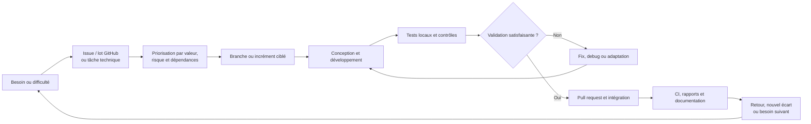

# C16 — Conduite du projet

## 1. Objet

Ce document décrit la manière dont le projet d’analyse du surendettement a été organisé, priorisé, réalisé, vérifié et amélioré progressivement. Il reconstitue la conduite réelle à partir de l’historique Git de `main`, des branches, des pull requests visibles dans les commits, des tests, de l’intégration continue et de la documentation du dépôt.

Il ne présente pas le projet comme un Scrum formel : aucun rôle Scrum, sprint, rituel ou mesure de vélocité n’est démontré. La formulation retenue est celle d’une **démarche individuelle, itérative et incrémentale inspirée des principes agiles**.

Référence auditée : branche `main`, commit `41c0ef1bd532c8caed3e2b795932740f0227ccf3`, historique du 8 avril au 3 septembre 2026.

## 2. Contexte de conduite

Le dépôt porte un projet individuel associant plusieurs domaines dépendants : collecte de données publiques, préparation et stockage, analyses territoriales, score statistique, APIs, application web, assistants d’intelligence artificielle, sécurité, tests, observabilité et documentation de certification.

Le périmètre s’est élargi par incréments. Le socle initial de collecte et de transformation a précédé l’API et la restitution ; le scoring a précédé l’intégration web ; la première intégration des assistants a ensuite été renforcée par la sécurité SQL, les benchmarks, la CI, l’observabilité et la documentation. Cet ordre est démontré par les dates et contenus des commits.

Le travail est individuel. Les responsabilités habituellement distribuées entre plusieurs personnes ont donc été cumulées, sans constituer pour autant des rôles Scrum. GitHub a servi au découpage en issues/lots, branches et pull requests. Les branches locales et les commits de fusion prouvent plusieurs lots ; le détail du tableau GitHub Projects et des issues doit être capturé directement dans GitHub, car il n’est pas versionné dans les fichiers du dépôt.

## 3. Méthode de gestion retenue

La conduite observable correspond à une démarche incrémentale : développer un sous-ensemble utilisable, le vérifier, corriger les difficultés constatées, puis intégrer le lot avant de poursuivre. La succession de commits `feat`, `test`, `fix`, `debug`, `restore`, de branches nommées par lots et de pull requests fusionnées étaye cette lecture.

La priorisation n’est pas formalisée dans un document de méthode. Elle peut néanmoins être décrite objectivement par l’ordre des dépendances et par les corrections visibles : données avant exposition, exposition avant interface, fonctions avant durcissement, puis validation et documentation.

| Élément de gestion | Mise en œuvre réelle | Preuve |
|---|---|---|
| Découpage du travail | Lots fonctionnels portés par des branches dédiées | Branches `16-lot-16-monitoring-de-lapplication`, `18-lot-17-documentation-et-modélisation-de-la-base-de-données`, `20-lot-18-veille-benchmark-et-évaluation-du-text-to-sql-sécurisé`, `22-lot-19-modélisation-merise-et-conformité-rgpd` |
| Suivi GitHub | Issues/lots et pull requests ; plusieurs numéros de PR sont conservés dans `main` | Commits de fusion des PR #17, #19, #21 et #23 ; tableau GitHub à capturer manuellement |
| Développement incrémental | Ajouts successifs pipeline, API, interface, score, Django, assistants, sécurité et supervision | `git log main`; historique détaillé en section 5 |
| Priorisation par dépendances | Acquisition et stockage avant APIs, puis usages web/IA | Commits `cb62e79`, `b74a06c`, `7a6d8e1`, `edbed8d` |
| Réduction progressive du risque | Corrections mémoire, migrations, sécurité, validation SQL et refus | Commits `75fa515`, `ead8c78`, `ca7c963`, `ac3afb4` |
| Validation automatisée | Tests ajoutés avec les fonctions puis chaîne CI unifiée | `tests/`, `app/tests/`, `web/*/tests.py`, `docker/run_ci.sh` |
| Intégration continue | Contrôles sur push, pull request et déclenchement manuel | `.github/workflows/ci.yml` |
| Documentation évolutive | README, documentation E1/E3, base de données et E4 | `README.md`, `docs/e1/`, `docs/e3/`, `database-doc/`, `docs/e4/` |
| Gestion des corrections | Commits explicites `fix`, `debug` et `restore`, suivis de nouveaux tests ou ajustements | Historique des 30 juillet, 21–26 août et 1–3 septembre 2026 |

Cette méthode était adaptée à un projet individuel et expérimental : elle permettait de limiter la taille des changements, de traiter les dépendances techniques dans l’ordre et de conserver une preuve vérifiable des décisions. Son principal défaut est l’absence d’un historique de backlog exporté et de critères de fin formalisés pour chaque lot.

## 4. Rôles et responsabilités

Les termes ci-dessous désignent des **responsabilités cumulées par la porteuse du projet**, et non une équipe ou des fonctions Scrum distinctes.

| Responsabilité | Activités réalisées | Preuve |
|---|---|---|
| Expression et cadrage du besoin | Définition d’une analyse territoriale du surendettement et de ses limites | `README.md`, `web/README.md`, `web/templates/dashboard/methodology.html` |
| Organisation et priorisation | Découpage en lots, branches et PR ; ordonnancement des dépendances | Branches Git `*-lot-*`, merges des PR #17, #19, #21, #23 |
| Collecte et préparation | Scraping, téléchargement, normalisation, agrégation et qualité | `src/scraper/`, `src/processing/`, `src/insee_macro/`, tests associés |
| Conception des données | Modèles, dimensions, faits, migrations et documentation Merise | `src/storage/`, `database-doc/` |
| Conception applicative | Séparation API analytique, Django et Assistant API | `app/`, `web/`, `assistant_api/`, `docker/compose.yaml` |
| Développement | Pipelines, APIs, interface, scoring, assistants et outils SQL | Historique Git et code des répertoires concernés |
| Validation | Tests unitaires/intégration, benchmarks, contrôles statiques et sécurité | `tests/`, `app/tests/`, `requirements-ci.txt`, `docker/run_ci.sh` |
| Intégration | Branches de lots, pull requests et fusion dans `main` | Commits de fusion et branches locales/distantes |
| Exploitation | Docker, healthchecks, métriques, alertes, sauvegarde et restauration | `docker/`, `web/security/observability.py`, `assistant_api/monitoring.py` |
| Documentation et certification | Dossiers E1, E3, E4 et documentation de base | `docs/`, `database-doc/` |

Aucun élément du dépôt ne permet d’attribuer ces responsabilités à des Product Owner, Scrum Master, développeurs ou testeurs différents.

## 5. Chronologie du projet

| Période / phase | Objectif | Réalisations | Preuves Git | Résultat |
|---|---|---|---|---|
| 8 avril–6 mai 2026 — Socle de collecte | Constituer une chaîne initiale de données Banque de France | Pipeline, scraper, traitement, stockage, tests et notebooks exploratoires | `cb62e79`, `e8a378e`, `26f9152`, `83b723c`, `4d38687` | Première chaîne de collecte et préparation testée |
| 2–30 juin — Données INSEE et passage à l’échelle | Ajouter les données macro-économiques et maîtriser leur volume | Appels INSEE, pipeline complet, chargement puis agrégation par chunks après crash | `7607d15`, `a94bb33`, `91cb978`, `75fa515` | Traitement départemental compatible avec un fichier de 6,8 Go |
| 1–2 juillet — Exposition et restitution initiale | Rendre les données consultables | API FastAPI, mart analytique, tests API puis application Streamlit | `b74a06c`, `7b4a6a4` | Premier incrément applicatif consultable |
| 28–30 juillet — Analyse et scoring | Enrichir la restitution et produire un score territorial | Données macro dans Streamlit, optimisations, score régional, dimensions harmonisées, préparation automatisation/Docker | `d6d6b14`, `c07e957`, `b51145f`, `bae2ad4`, `47d90c5` | Chaîne analytique structurée et versionnable |
| 30 juillet — Migration et déploiement local | Passer vers PostgreSQL et vérifier la migration | Correction Docker PostgreSQL, validation de migration, initialisation Django | `ead8c78`, `1ae76c2` | Environnement intégré mieux reproductible |
| 14–19 août — Application Django et assistants | Ajouter corpus, LLM, inscription et conversations | Premier corpus, fournisseur OpenAI, comptes, interface Django, appels interservices et persistance des conversations | `bc79751`, `11070b1`, `7a6d8e1` | Application web authentifiée intégrant un assistant |
| 19–21 août — Text-to-SQL et sécurisation | Ajouter l’analyse avancée sans exposer les données à l’écriture | Agent SQL, validation, exécution read-only, audits, sécurité, CI et migrations analytiques | `edbed8d`, `ca7c963`, `388de02`, `813aca7`, `b056888` | Fonction SQL encadrée et validée automatiquement |
| 21–25 août — Front et exploitation | Améliorer l’usage et rendre les services observables | Évaluation RAG, interface, carte, gestion des comptes, qualité, métriques, Grafana/Prometheus et tests de panne | `e6faa2f`, `e6faa2f`, `6caa5ac`, `52d8501`, `567f80b`, `9b01f4d`, `b965697` | POC enrichi et observable |
| 25–29 août — Modélisation et conformité | Rendre le stockage et les traitements compréhensibles et conformes | Inventaire PostgreSQL, MCD/MLD/MPD, dépréciation du RAG historique, RGPD visible | `254c482`, `23f6b4c`, `4bb4088`, `2bfccc9` et merges des lots 17/19 | Documentation de données traçable et dette RAG explicitée |
| 26 août–1 septembre — Benchmark et consolidation POC | Mesurer et renforcer le Text-to-SQL | Benchmark, fixture PostgreSQL, validation des colonnes, clarification avant LLM, intégration CI et consolidation du POC | `135ffca`, `618c27b`, `d4c2018`, `6ac7474`, `5660ec3`, `f2a1e4e`, `9c43b35`, `58155a0` | Évaluation reproductible et cas adversariaux couverts |
| 1–3 septembre — Finalisation et gestion d’un écart de déploiement | Stabiliser le dossier et résoudre les problèmes d’intégration | Documentation E3, essais Render, correctifs CI/tokens, diagnostics Assistant, restauration de `main`, réinitialisation RAG/SQL | `2eafe3f`, `51a4e8c` à `417f600`, `d04f136`, `ac3afb4`, `41c0ef1` | Déploiement externe retiré ; socle local restauré et corrigé |

La ligne « front et exploitation » ne constitue pas un sprint. Elle regroupe des changements proches dans le temps pour rendre la chronologie lisible.

## 6. Cycles d’itération

### Cycle 1 — Constituer des données exploitables

**Objectif :** acquérir et normaliser des données Banque de France puis INSEE.

**Travaux :** scraper, téléchargement, parsing, nettoyage, modèles de stockage, ingestion, notebooks et pipeline INSEE.

**Validation :** tests du scraper, du parseur, du téléchargement, de la transformation et des imports.

**Écart / difficulté :** une agrégation d’un CSV de 6,8 Go a provoqué un crash, information explicitement conservée dans le message du commit `75fa515`.

**Correction / amélioration :** passage à une agrégation par chunks et par département dans `src/insee_macro/pipeline.py`.

**Preuves :** `cb62e79`, `a94bb33`, `75fa515`, `tests/test_spider.py`, `tests/test_transform.py`.

### Cycle 2 — Exposer et visualiser les analyses

**Objectif :** passer d’une pipeline à une première application de consultation.

**Travaux :** API FastAPI, mart analytique, Streamlit, intégration macro-économique et optimisations.

**Validation :** tests de l’API et de la construction de la base analytique.

**Écart / difficulté :** la restitution a nécessité plusieurs optimisations successives du pool de données.

**Correction / amélioration :** commits dédiés à l’optimisation les 28 et 29 juillet.

**Preuves :** `b74a06c`, `7b4a6a4`, `c07e957`, `0c7e69c`, `app/tests/views/test_analytics_api.py`, `tests/test_analytics_db.py`.

### Cycle 3 — Structurer le score et PostgreSQL

**Objectif :** produire un indicateur territorial explicable et fiabiliser son stockage.

**Travaux :** score régional, configurations, détails, dimensions, harmonisation des identifiants et migration PostgreSQL.

**Validation :** tests du score, comparaisons et validation de migration.

**Écart / difficulté :** architecture initiale des tables et Docker PostgreSQL à corriger.

**Correction / amélioration :** harmonisation des dimensions puis test de migration explicite.

**Preuves :** `b51145f`, `bae2ad4`, `ead8c78`, `app/tests/test_risk_score.py`, `app/tests/test_postgres_migration.py`.

### Cycle 4 — Intégrer Django et l’assistant

**Objectif :** fournir une application authentifiée et conserver les échanges avec l’assistant.

**Travaux :** Django, inscription, rôles, clients internes, conversations, corpus et adaptateur OpenAI.

**Validation :** tests de comptes, permissions, clients Assistant et isolation des conversations.

**Écart / difficulté :** exposition de l’API à Django et premier corpus à reprendre.

**Correction / amélioration :** appels interservices configurables et, plus tard, dépréciation du corpus RAG Django historique.

**Preuves :** `bc79751`, `11070b1`, `7a6d8e1`, `4bb4088`, `web/accounts/tests.py`, `web/assistant/test_views.py`.

### Cycle 5 — Sécuriser et évaluer le Text-to-SQL

**Objectif :** permettre l’analyse SQL avancée sans autoriser de modification de données.

**Travaux :** génération, parseur, listes blanches, connexion read-only, `EXPLAIN`, limites, audit, benchmark et clarification avant LLM.

**Validation :** tests adversariaux, fixture PostgreSQL, benchmark hors ligne et intégration du benchmark à la CI.

**Écart / difficulté :** corrections successives de sécurité, colonnes SQL, fixture et assistant SQL.

**Correction / amélioration :** validation AST enrichie, clarification des questions ambiguës et nouveaux cas de benchmark.

**Preuves :** `edbed8d`, `8593db5`, `d4c2018`, `6ac7474`, `5660ec3`, `tests/test_sql_validation.py`, `tests/test_text_to_sql_benchmark.py`.

### Cycle 6 — Industrialiser le POC

**Objectif :** rendre les incréments vérifiables et observables.

**Travaux :** GitHub Actions, Docker multi-cibles, audits, tests Django/FastAPI, healthchecks, métriques, alertes, logs et tests de panne.

**Validation :** script CI en huit étapes, smoke test de l’image Assistant et rapports publiés comme artefacts.

**Écart / difficulté :** plusieurs corrections CI, sécurité et monitoring sont visibles après l’introduction initiale.

**Correction / amélioration :** ajustement des schémas, mot de passe Grafana éphémère et tests du monitoring en condition d’échec.

**Preuves :** `ca7c963`, `06631f5`, `9b01f4d`, `d7eebf9`, `b965697`, `.github/workflows/ci.yml`, `docker/run_ci.sh`.

### Cycle 7 — Documenter, tenter le déploiement puis restaurer

**Objectif :** finaliser les preuves RNCP et rechercher un environnement démontrable.

**Travaux :** documentation E3, captures, configuration Render expérimentale, correctifs de connexion, diagnostics Assistant.

**Validation :** modifications successives du workflow et tests de diagnostic.

**Écart / difficulté :** la tentative Render n’a pas fourni une cible retenue et a introduit des problèmes de connexion/intégration.

**Correction / amélioration :** restauration du contenu de `main` à un état antérieur, suppression de `render.yaml`, puis réinitialisation du RAG et des parseurs SQL.

**Preuves :** commits du 2 septembre `51a4e8c` à `adbe54a`, diagnostics `b00edfb` et `417f600`, restauration `d04f136`, correction `ac3afb4`.

## 7. Priorisation

Le dépôt ne contient pas de matrice MoSCoW, de scoring RICE ou de déclaration formelle de MVP. Ces méthodes ne sont donc pas revendiquées. La priorité ci-dessous est une lecture de l’ordre réellement observé, appuyée sur les dépendances et les corrections.

| Sujet | Priorité observée | Justification | Preuve |
|---|---|---|---|
| Acquisition et qualité des données | Fondatrice | Aucune analyse ni API n’est possible sans données préparées | Premiers commits et `src/` |
| Maîtrise de la volumétrie | Bloquante après incident | Le crash du fichier de 6,8 Go empêchait l’agrégation | `75fa515` |
| API analytique | Haute après le socle données | Fournit un contrat de consommation aux interfaces | `b74a06c`, `app/main.py` |
| Score territorial et modèle de données | Haute | Apporte la valeur analytique et sa traçabilité | `b51145f`, `bae2ad4` |
| PostgreSQL et migrations | Haute avant intégration | Assure stockage commun et reproductibilité | `ead8c78`, `813aca7` |
| Authentification et rôles | Haute avant ouverture des fonctions | Protège dashboard et assistants | `7a6d8e1`, `web/accounts/` |
| Sécurité Text-to-SQL | Bloquante avec l’ajout du SQL | Une génération non validée exposerait la base | `edbed8d`, `ca7c963`, `b056888` |
| Tests et CI | Transverse puis renforcée | Valide les incréments et les corrections | Tests présents dès `cb62e79`, CI à `ca7c963` |
| Benchmark et clarification | Haute avant consolidation du POC | Mesure les régressions et réduit les demandes ambiguës | `6ac7474`, `5660ec3` |
| Observabilité | Haute pour l’exploitation | Rend erreurs, santé et performance visibles | Lot 16, `9b01f4d` |
| Documentation et conformité | Haute en phase de certification | Transforme l’implémentation en preuves vérifiables | lots 17/19, `docs/`, `database-doc/` |

## 8. Outils de pilotage et de suivi

| Outil | Usage | Apport au pilotage | Preuve |
|---|---|---|---|
| Git | Historique, branches, commits, corrections et restaurations | Chronologie et retour à un état maîtrisé | `git log main`, branches locales/distantes |
| Dépôt GitHub | Hébergement du dépôt et revue/intégration par pull requests | Centralise code et intégrations | Remote `ludivineRB/surendettement_analyse`, commits `Merge pull request` |
| GitHub Issues / Projects | Découpage déclaré en issues et lots, suivi sur un tableau | Support de priorisation et d’avancement | Information fournie par la porteuse ; branches `*-lot-*`; capture GitHub requise |
| Pull requests | Intégration des lots dans `main` | Point de validation et traçabilité des lots | PR #17, #19, #21, #23 et autres visibles dans l’historique |
| GitHub Actions | Validation automatique | Détecte régressions avant/après intégration | `.github/workflows/ci.yml` |
| pytest et tests Django | Validation fonctionnelle et technique | Critères exécutables pour chaque incrément | `tests/`, `app/tests/`, `web/` |
| Benchmark Text-to-SQL/RAG | Mesure des comportements et refus | Suit la qualité des composants IA | `benchmark/`, `assistant_api/evaluation.py` |
| Docker Compose | Environnement reproductible | Réduit les écarts entre validation locale et CI | `docker/compose.yaml`, `docker/run_ci.sh` |
| Rapports générés | JUnit, couverture, évaluation et migration | Matérialise le résultat des validations | `app/reports/`, `.github/workflows/ci.yml` |
| Markdown et diagrammes | Décisions, exploitation, base et certification | Conserve une documentation révisable avec le code | `README.md`, `docs/`, `database-doc/`, `models/LOT-16-RUNBOOK.md` |

Codex n’est pas retenu comme outil officiel de pilotage : son usage historique n’est pas démontré par `main` et ne remplace ni GitHub ni les preuves versionnées.

## 9. Validation à chaque itération

Les validations n’ont pas toutes existé dès le premier commit. Elles se sont renforcées progressivement : tests unitaires dès le socle, tests API et PostgreSQL avec les nouveaux composants, puis CI, sécurité et benchmarks.

| Validation | Moment / déclenchement | Risque couvert | Preuve |
|---|---|---|---|
| Tests scraper et transformation | Dès le socle | Régression de collecte/normalisation | `tests/test_spider.py`, `tests/test_parser.py`, `tests/test_transform.py` |
| Tests analytiques et API | Avec l’API et le scoring | Contrats, calculs et vues | `app/tests/`, `tests/test_analytics_db.py` |
| Tests Django | Avec les comptes et assistants | Accès, rôles, sessions, propriété des conversations | `web/accounts/tests.py`, `web/dashboard/tests.py`, `web/assistant/test_views.py` |
| PostgreSQL jetable et migrations | Après migration du stockage | Schéma, idempotence et reprise | `app/tests/test_postgres_migration.py`, `docker/test_postgres_migration.sh` |
| Validation SQL | Avec l’agent SQL | Écriture, contournement, coût et volumétrie | `tests/test_sql_validation.py`, `tests/test_sql_executor.py` |
| Benchmark Text-to-SQL | Consolidation du POC | Régressions sur cas métier/adversariaux | `benchmark/`, `tests/test_text_to_sql_benchmark.py` |
| Évaluation RAG hors ligne | CI | Routage, preuves et refus sans clé externe | `assistant_api/evaluation.py`, `docker/CI.md` |
| Ruff, mypy et Bandit | CI | Défauts statiques, typage et sécurité | `requirements-ci.txt`, `docker/run_ci.sh` |
| `pip-audit` | CI | Vulnérabilités connues des dépendances | `docker/run_ci.sh` |
| Build et validation Compose | CI | Reproductibilité des images/configurations | `docker/Dockerfile`, `docker/run_ci.sh` |
| Smoke test Assistant | Après build CI | Démarrage réel de l’image livrable | `.github/workflows/ci.yml` |

La CI est déclenchée sur `push`, `pull_request` et manuellement. La concurrence annule une exécution devenue obsolète pour la même référence. Elle publie les rapports pendant quatorze jours. Ces validations sécurisent les incréments, mais la recette générative réelle avec fournisseur externe demeure locale et manuelle (`docker/CI.md`).

## 10. Gestion des difficultés et des écarts

| Difficulté démontrée | Impact | Décision prise | Résultat | Preuve |
|---|---|---|---|---|
| Crash lors de l’agrégation d’un CSV de 6,8 Go | Pipeline inutilisable sur le volume réel | Traiter par chunks et agréger par département | Pipeline adapté au volume | `75fa515`, `src/insee_macro/pipeline.py` |
| Architecture de tables et identifiants hétérogènes | Jointures et scores fragiles | Créer/harmoniser dimensions, valeurs et scores | Modèle analytique consolidé | `bae2ad4`, `src/storage/` |
| Docker PostgreSQL et migration à fiabiliser | Environnement non reproductible | Corriger l’image/processus et ajouter un test de migration | Rapport et test dédiés | `ead8c78`, `app/reports/postgres_migration_validation.*` |
| Text-to-SQL potentiellement dangereux | Risque d’écriture ou de charge | AST, listes blanches, read-only, limites, `EXPLAIN` et audit | Requêtes dangereuses refusées par tests | `edbed8d`, `assistant_api/sql_validation.py`, `tests/test_sql_executor.py` |
| Ancien corpus RAG devenu incohérent avec le service autonome | Double source et risque de mauvaise provenance | Déprécier les tables/commandes historiques et documenter le remplacement | `assistant.corpus_chunks` devient la source canonique documentée | `4bb4088`, `web/assistant/migrations/0005_deprecate_legacy_rag_corpus.py` |
| Questions SQL comparatives incomplètes | SQL ambigu avant génération | Détecter puis demander une clarification avant LLM | Cas ambigus arrêtés plus tôt | `6ac7474`, `assistant_api/sql_service.py` |
| Problèmes répétés de CI, schémas et sécurité | Intégration instable | Commits correctifs ciblés et nouveaux contrôles | Chaîne CI consolidée | `06631f5`, `6f0f6c8`, `38cce31`, `b056888` |
| Monitoring à éprouver | Pannes mal observées | Ajouter alertes, notifications et test en condition d’échec | Exploitation locale observable | `9b01f4d`, `b965697`, `docker/monitoring/` |
| Tentative Render non concluante | Déploiement externe et connexions instables | Diagnostiquer puis restaurer `main` à un socle antérieur | `render.yaml` et tests associés supprimés ; local/CI conservés | `51a4e8c` à `417f600`, `d04f136` |
| RAG et parseurs SQL après restauration | Comportements à rétablir | Réinitialiser registre et génération, ajuster tests/clients | Correctif intégré à `main` | `ac3afb4`, merge `41c0ef1` |
| Rôle `administrator` distinct de `is_superuser` | Permission applicative non utilisée par certains écrans d’administration | Écart documenté, non corrigé artificiellement | Décision fonctionnelle restant à prendre | `web/accounts/migrations/0001_initial_roles.py`, `web/accounts/views.py` |

## 11. Amélioration continue

| Avant | Problème | Amélioration | Preuve |
|---|---|---|---|
| Agrégation globale en mémoire | Crash sur forte volumétrie | Traitement par chunks | `75fa515` |
| Pipeline sans contrat de consommation | Données difficiles à intégrer | API FastAPI et tests de contrat | `b74a06c` |
| Restitution descriptive | Analyse territoriale limitée | Score, facteurs et versions de modèle | `b51145f`, `0ee0e8a` |
| Stockages et identifiants hétérogènes | Cohérence analytique fragile | Dimensions conformes et PostgreSQL | `bae2ad4`, `813aca7` |
| Interface sans gestion de compte intégrée | Accès non piloté | Django, inscription, rôles et conversations | `7a6d8e1` |
| Assistant documentaire seul | Analyse avancée limitée | Assistant SQL séparé et audité | `edbed8d` |
| SQL généré sans couverture adversariale suffisante | Risque de requête erronée/dangereuse | Benchmark, fixture, validation des colonnes et clarification | `d4c2018`, `6ac7474`, `5660ec3` |
| Contrôles locaux dispersés | Régressions d’intégration | CI reproductible, audits et artefacts | `ca7c963`, `.github/workflows/ci.yml` |
| Santé peu visible | Diagnostic d’exploitation difficile | Métriques, logs, alertes et test de panne | `9b01f4d`, `b965697` |
| Deux implémentations RAG | Ambiguïté de source de vérité | Dépréciation documentée de l’ancien RAG | `4bb4088` |
| Déploiement externe instable | Risque de conserver une configuration non maîtrisée | Restauration explicite puis correctifs ciblés | `d04f136`, `ac3afb4` |
| Documentation technique fragmentaire | Preuves de certification difficiles à suivre | Documents E1, E3, base et E4 | `docs/e1/`, `docs/e3/`, `database-doc/`, `docs/e4/` |

## 12. Traçabilité Git

L’échantillon suivant couvre les principales phases et difficultés. Les SHA complets et dates ont été vérifiés avec `git show` sur `main`.

| Commit | Date | Objet | Contribution au projet |
|---|---|---|---|
| `cb62e79b079667e6ef7cdd6888fa988b42f104e7` | 2026-04-08 | Création du projet | Ajoute pipeline, scraper, stockage et premiers tests |
| `75fa515621ef6c742315c174b283bbfb3d5cbd6a` | 2026-06-30 | Agrégation par chunks après crash | Traite explicitement le problème du CSV de 6,8 Go |
| `b74a06c17e73458eaf8112c2fb8c307dfbe51602` | 2026-07-01 | API fonctionnelle | Ajoute FastAPI, mart analytique et tests API |
| `b51145f01725390c61bc1784b3ed0354f64d6ba5` | 2026-07-29 | Score de risque régional | Introduit scoring, configuration, API et tests |
| `ead8c78c48786d5a5390219466d8ddae0b628ece` | 2026-07-30 | Correction Docker/PostgreSQL | Ajoute test et rapport de validation de migration |
| `7a6d8e1a285be6532f02f531906ca16cb4aa7a43` | 2026-08-19 | Inscription Django et connexion API | Intègre comptes, conversations et clients web |
| `edbed8d2878f7ed93f072ed6d08e341ba86cfd81` | 2026-08-19 | Création de l’agent SQL | Ajoute génération, validation, read-only, audit et tests |
| `ca7c963195834a6ab55fc94d3b0ca6203387935b` | 2026-08-20 | Sécurité et CI | Introduit workflow, audits, rapports, rétention et tests de sécurité |
| `9b01f4d194abed024a83149b759ab5dcabcd3953` | 2026-08-24 | Initialisation du monitoring | Ajoute métriques, Grafana, Prometheus, Loki et alertes |
| `4bb4088ff3b115396f3f35d956abe711d9e11f08` | 2026-08-26 | Dépréciation de l’ancien RAG | Corrige l’architecture documentaire et sa documentation |
| `5660ec3c881ce5d81b7630d9aa6268186b4a265f` | 2026-08-26 | Benchmark Text-to-SQL dans la CI | Rend l’évaluation SQL automatique |
| `2bfccc9eea90298a77d69930e16ae81bfe5dd5af` | 2026-08-28 | Documentation RGPD | Ajoute information utilisateur et page de confidentialité |
| `d04f13698eeed4f4b8320c94f6b9750a137f92d7` | 2026-09-03 | Restauration de `main` | Retire la configuration Render et revient à un socle maîtrisé |
| `ac3afb4d68f962b242408dcee5bb389e49424ee8` | 2026-09-03 | Réinitialisation RAG et SQL | Corrige registre, génération SQL, client analytique et tests |

### Lots et pull requests vérifiables

| Lot / branche | Commit de fin de branche | Intégration dans `main` | Domaine |
|---|---|---|---|
| `16-lot-16-monitoring-de-lapplication` | `b9656975574644c49d0f622cb78929db37252c24` | PR #17, merge `e3b302d` du 2026-08-25 | Monitoring et comportement en panne |
| `18-lot-17-documentation-et-modélisation-de-la-base-de-données` | `896f87af901040f7d8d2c0f2c56155b1ba815d8e` | PR #19, merge `8639ba8` du 2026-08-26 | Documentation et modélisation de la base |
| `20-lot-18-veille-benchmark-et-évaluation-du-text-to-sql-sécurisé` | `02bedc8b698fba9ceec857cae2aa92f769f45f7d` | PR #21, merge `be52c21` du 2026-08-27 | Benchmark Text-to-SQL sécurisé |
| `22-lot-19-modélisation-merise-et-conformité-rgpd` | `2da57f5d312746748aa40b46273955976080c58d` | PR #23, merge `7788420` du 2026-08-29 | Merise et conformité RGPD |

Les intitulés des branches et messages de fusion sont des preuves Git locales. Les champs de priorité, colonnes, dates ou états détaillés du GitHub Project et des issues ne sont pas recopiés ici faute d’export versionné ; ils doivent être montrés par capture dans le rapport.

## 13. Synthèse de la démarche

Ce cycle est une synthèse des traces observées. Il ne signifie pas que chaque changement disposait systématiquement d’une issue, d’une branche dédiée ou d’une revue par une autre personne.

## 14. Preuves à capturer pour le rapport

| Capture | Contenu attendu | Critère C16 |
|---|---|---|
| Vue chronologique Git | Commits datés d’avril à septembre 2026 | Étapes et amélioration progressive |
| GitHub Project | Colonnes, lots/issues, états et priorités réellement présents | Organisation, priorisation et suivi |
| Liste des issues | Numéro, titre, état et rattachement aux lots | Backlog et avancement réels |
| Issue d’un lot représentatif | Besoin, critères ou échanges effectivement saisis | Expression et suivi du travail |
| Branches GitHub | Branches `*-lot-*` et branches de finalisation | Découpage incrémental |
| Pull request fusionnée | Exemple PR #17, #19, #21 ou #23 avec commits/contrôles | Validation et intégration |
| GitHub Actions | Workflow réussi et détail des jobs | Validation régulière |
| Rapports CI | JUnit, couverture, benchmark RAG/Text-to-SQL | Mesure des incréments |
| Commit `75fa515` | Message et diff du traitement par chunks | Gestion d’une difficulté de volumétrie |
| Commit `4bb4088` | Dépréciation et documentation du RAG historique | Gestion d’un écart d’architecture |
| Commits `d04f136` / `ac3afb4` | Restauration puis correction | Capacité de retour arrière et amélioration |
| Évolution documentaire | `docs/e1`, `docs/e3`, `database-doc`, `docs/e4` | Documentation progressive |

Les captures GitHub devront être réalisées sur le projet réel. Elles ne doivent pas être recréées ou retouchées pour simuler des métadonnées absentes.

## 15. Limites de la conduite de projet

- Le projet est individuel : aucune répartition d’équipe, revue croisée ou capacité collective n’est démontrable.
- Aucune application formelle de Scrum n’est prouvée : pas de Scrum Master, Product Owner, daily meeting, sprint review ou rétrospective attestés.
- Aucune durée de sprint, vélocité, burndown chart ou estimation systématique n’est versionnée.
- Le contenu complet du GitHub Project et des issues n’est pas exporté dans le dépôt ; sa preuve nécessite des captures directes.
- L’historique montre des lots et PR, mais ne prouve pas que chaque commit était rattaché à une issue.
- Certains messages de commit sont courts, imprécis ou comportent des erreurs ; la contribution doit alors être vérifiée par le diff.
- Plusieurs changements ont été regroupés dans de gros commits, notamment l’intégration Django et l’agent SQL, ce qui réduit la granularité de suivi.
- Les essais de déploiement des 2–3 septembre ont nécessité une restauration : l’environnement externe n’est pas une preuve de préproduction stable.
- Une partie de la documentation de certification a été consolidée en fin de projet ; elle formalise l’existant mais ne prouve pas à elle seule un pilotage continu depuis avril.

Git, les branches de lots, les pull requests, les tests, la CI et les rapports compensent partiellement ces limites en fournissant une chronologie objective, des validations exécutables et des traces de correction. Ils ne doivent toutefois pas être présentés comme l’équivalent complet d’un cadre agile institutionnalisé.

## 16. Matrice de conformité C16

| Attendu C16 | Élément produit | Preuve | Statut |
|---|---|---|---|
| Méthode de gestion adaptée | Démarche individuelle, itérative et incrémentale explicitée sans faux Scrum | Section 3, `git log main` | Couvert |
| Cycles / étapes identifiables | Chronologie et sept cycles fondés sur les changements réels | Sections 5 et 6 | Couvert |
| Rôles et responsabilités | Responsabilités cumulées par la porteuse du projet | Section 4, code et documentation | Couvert sans équipe fictive |
| Priorisation | Dépendances, valeur, blocages et réduction du risque | Section 7, ordre des commits | Couvert ; méthode formelle non revendiquée |
| Outils de pilotage | Git, GitHub, Issues/Projects, PR, CI, tests, Docker et Markdown | Section 8 | Couvert ; Project à capturer |
| Suivi de l’avancement | Lots, branches, fusions et historique daté | Sections 5 et 12 | Couvert |
| Validations régulières | Tests progressifs, CI, audits, benchmarks et smoke test | Section 9, `docker/run_ci.sh` | Couvert |
| Gestion des écarts | Volumétrie, migrations, SQL, RAG, CI et restauration | Section 10 | Couvert |
| Amélioration continue | Tableau avant/problème/amélioration avec preuves | Section 11 | Couvert |
| Traçabilité | 14 commits exacts, lots et PR représentatifs | Section 12 | Couvert |

### Conclusion

La conduite observée est adaptée à un projet individuel complexe : les fonctions ont été construites par dépendances, validées de façon croissante et corrigées lorsque des incidents techniques sont apparus. Les branches de lots, pull requests, tests, rapports et restaurations rendent cette progression explicable au jury.

La preuve C16 reste plus solide si le rapport ajoute des captures datées du GitHub Project et des issues réelles. Cette recommandation complète les traces Git sans inventer une organisation Scrum qui n’a pas existé.
