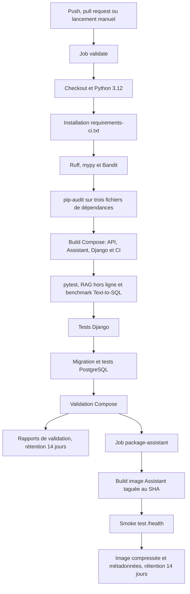

# C18 — Intégration continue

## 1. Objet

Ce document décrit la chaîne d’intégration continue réellement versionnée dans le dépôt
`ludivineRB/surendettement_analyse`. Il constitue une preuve pour la compétence C18 du bloc 3
RNCP37827. L’audit porte sur la configuration présente dans les sources ; un résultat GitHub
Actions doit être capturé séparément pour prouver une exécution distante réussie.

## 2. Périmètre

La chaîne automatise les contrôles statiques et de sécurité, les tests Python et Django, deux
évaluations hors ligne de l’assistant, une migration vers PostgreSQL jetable, la validation des
fichiers Compose, puis le packaging de l’Assistant API. Elle ne déploie pas l’application.

Sources principales auditées :

- `.github/workflows/ci.yml` ;
- `docker/run_ci.sh` et `docker/test_postgres_migration.sh` ;
- `docker/Dockerfile` et `docker/compose*.yaml` ;
- `requirements-ci.txt`, les fichiers `requirements*.txt` et `pyproject.toml` ;
- `tests/`, `app/tests/`, `web/`, `assistant_api/` et `benchmark/` ;
- `docker/CI.md`, `README.md` et `web/README.md`.

## 3. Outil d’intégration continue

L’outil est **GitHub Actions**, avec un workflow nommé `Validation`. Ce choix est cohérent avec
l’hébergement GitHub du code et permet de versionner la chaîne avec les sources. Le workflow
accorde uniquement la permission `contents: read`.

Deux jobs sont définis :

1. `validate`, qui prépare Python, lance `docker/run_ci.sh` et publie les rapports ;
2. `package-assistant`, qui dépend du succès de `validate`, construit et teste l’image de
   l’Assistant API, puis l’exporte comme artefact.

## 4. Déclencheurs

| Déclencheur | Configuration | Objectif | Preuve |
|---|---|---|---|
| Pull request | `pull_request:` sans filtre | Valider les changements proposés sur toute branche ciblée | `.github/workflows/ci.yml` |
| Push | `push:` sans filtre | Valider tout push, sans restriction de branche ou de chemin | `.github/workflows/ci.yml` |
| Manuel | `workflow_dispatch:` | Autoriser une exécution à la demande depuis GitHub | `.github/workflows/ci.yml` |

La concurrence est regroupée par référence avec `group: ci-${{ github.ref }}`. Un nouveau run
sur la même référence annule le précédent grâce à `cancel-in-progress: true`. Il n’existe ni
planification périodique, ni filtre de branches ou de chemins.

## 5. Architecture de la CI



Le job `package-assistant` ne démarre qu’après la réussite de `validate`. Les publications de
rapports de validation et l’affichage de l’état Compose utilisent `if: always()` ; ils restent
donc tentés même après un échec du script.

## 6. Préparation de l’environnement

| Élément | Configuration réelle | Preuve |
|---|---|---|
| Runner | `ubuntu-latest` | `.github/workflows/ci.yml` |
| Python | 3.12 via `actions/setup-python@v5` | `.github/workflows/ci.yml` |
| Cache | Cache pip indexé par `requirements-ci.txt` ; aucun cache Docker déclaré | `.github/workflows/ci.yml` |
| Installation hôte | `python -m pip install --requirement requirements-ci.txt` | `.github/workflows/ci.yml` |
| Conteneur de test | Cible `ci` du Dockerfile, complétée par `requirements-ci.txt` et `assistant_api/requirements.txt` | `docker/Dockerfile` |
| Base de données | PostgreSQL 16 Alpine, healthcheck `pg_isready` | `docker/compose.yaml` |
| Docker | Fourni par le runner GitHub ; version non fixée par le dépôt | workflow et scripts Docker |
| Fichiers temporaires | Fixture SQLite synthétique sous `app/reports/ci-fixtures/` si la source est absente | `docker/test_postgres_migration.sh` |

Variables du job `validate` : base, utilisateur et mot de passe PostgreSQL éphémères ; clé
Django et jeton interne réservés à la CI ; nom de projet Compose isolé par `github.run_id` ;
`OPENAI_API_KEY` explicitement vide. La recette GitHub n’appelle donc pas le fournisseur
OpenAI réel. Aucun secret de production n’est nécessaire à ce workflow.

## 7. Étapes et tâches

### Job `validate`

| Ordre | Étape | Commande ou action | Objectif | Condition |
|---:|---|---|---|---|
| 1 | Checkout | `actions/checkout@v4` | Récupérer les sources | Succès normal |
| 2 | Python | `actions/setup-python@v5`, Python 3.12, cache pip | Préparer l’interpréteur | Succès normal |
| 3 | Outils CI | `python -m pip install --requirement requirements-ci.txt` | Installer Ruff, mypy, Bandit, pip-audit et pytest-cov | Succès normal |
| 4 | Validation | `sh docker/run_ci.sh` | Exécuter la chaîne reproductible | Succès normal |
| 5 | Rapports | `actions/upload-artifact@v4` sur `app/reports/` | Conserver les preuves pendant 14 jours | Toujours ; absence de fichier = avertissement |
| 6 | État final | `docker compose --profile ci -f docker/compose.yaml ps --all` | Faciliter le diagnostic | Toujours |

Le job a un délai maximal de 60 minutes.

### Décomposition de `docker/run_ci.sh`

Le script utilise `#!/bin/sh` et `set -eu` : il s’arrête sur une commande en échec et sur une
variable non définie. Il n’active pas explicitement `pipefail`. Des valeurs CI par défaut sont
définies, puis `app/reports/ci` est créé.

| Ordre | Bloc | Commande synthétique | Objectif |
|---:|---|---|---|
| 1 | Contrôles statiques | Ruff, mypy ciblé, Bandit | Syntaxe/lint, typage progressif et analyse de sécurité |
| 2 | Dépendances | Trois commandes `pip_audit -r` | Rechercher des vulnérabilités connues |
| 3 | Build | `docker compose --profile ci ... build api assistant-api django ci` | Construire quatre cibles nécessaires aux validations |
| 4 | Tests et évaluations | pytest hors PostgreSQL, RAG hors ligne, Text-to-SQL hors ligne | Tester le code et produire les rapports principaux |
| 5 | Django | `python web/manage.py test web.accounts web.dashboard web.assistant web.security` | Tester quatre applications Django |
| 6 | PostgreSQL | `CONFIRM_LOCAL_MIGRATION=yes sh docker/test_postgres_migration.sh` | Tester dry-run, copie, intégration et équivalence des données |
| 7 | Compose | Trois `docker compose ... config --quiet` | Valider les configurations de base, production et staging |
| 8 | Fin | Message de succès | Signaler la réussite complète |

`docker/test_postgres_migration.sh` utilise également `set -eu`. Il refuse une base dont le nom
ne contient pas `local`, `staging` ou `test`, exige un mot de passe, Docker, Compose v2 et un
daemon disponible, attend PostgreSQL, effectue un dry-run, puis une migration confirmée. Il
exécute le test PostgreSQL de migration et génère les rapports JSON et Markdown d’équivalence.
Une divergence fait terminer le script avec un code non nul. Aucun volume n’est supprimé
automatiquement.

### Job `package-assistant`

| Ordre | Étape | Commande ou action | Objectif | Condition |
|---:|---|---|---|---|
| 1 | Checkout | `actions/checkout@v4` | Récupérer les sources | Après succès de `validate` |
| 2 | Build | `docker build --target assistant-api --tag surendettement-assistant:${{ github.sha }} .` | Produire une image versionnée | Succès normal |
| 3 | Smoke test | `docker run`, puis jusqu’à 20 appels à `/health` espacés de 2 s | Vérifier le démarrage de l’image | Succès normal |
| 4 | Export | `docker image inspect`, `docker save | gzip` | Produire métadonnées et archive d’image | Succès normal |
| 5 | Publication | `actions/upload-artifact@v4` | Publier l’image pendant 14 jours | Fichiers obligatoires |
| 6 | Logs | `docker logs assistant-smoke || true` | Fournir un diagnostic du smoke test | Toujours |

Le job a un délai maximal de 20 minutes.

## 8. Tests exécutés

| Famille | Exécutée en CI ? | Commande | Preuve |
|---|:---:|---|---|
| Tests unitaires Python | Oui | `pytest -q tests app/tests -m 'not postgres_integration'` | `docker/run_ci.sh` |
| FastAPI et API analytique | Oui | Même commande, notamment `tests/test_assistant_api.py` et `app/tests/views/test_analytics_api.py` | Tests versionnés |
| RAG | Oui | pytest puis `python -m assistant_api.evaluation --offline` | Script CI et `assistant_api/evaluation.py` |
| Text-to-SQL et sécurité SQL | Oui | pytest puis `python -m benchmark.evaluation` | `tests/test_sql_*.py`, `tests/test_text_to_sql_benchmark.py`, script CI |
| Django comptes/dashboard/assistant/sécurité | Oui | `manage.py test web.accounts web.dashboard web.assistant web.security` | `docker/run_ci.sh` |
| Migration PostgreSQL | Oui | `pytest app/tests/test_postgres_migration.py -m postgres_integration` | `docker/test_postgres_migration.sh` |
| Validation métier SQLite/PostgreSQL | Oui | Comparaisons intégrées au script de migration | `docker/test_postgres_migration.sh` |
| Smoke test d’image | Oui, Assistant uniquement | Conteneur et appel `/health` | `.github/workflows/ci.yml` |
| Tests de packaging | Partiel | Build, démarrage et export de l’Assistant | `.github/workflows/ci.yml` |
| Navigateur E2E | Non | Aucune commande | Workflow audité |
| Appels OpenAI réels | Non | Évaluation RAG `--offline`, clé vide | workflow et `docker/CI.md` |

### Tests présents mais non exécutés automatiquement

- `web/analytics/tests.py` n’appartient à aucun des quatre labels Django explicitement lancés ;
- le test marqué `postgres_integration` dans `tests/test_text_to_sql_benchmark.py` est exclu du
  premier pytest, tandis que le script PostgreSQL ne lance que
  `app/tests/test_postgres_migration.py` ;
- `benchmark/test_benchmark.py` est hors des répertoires explicitement transmis à pytest et
  hors des `testpaths` de `pyproject.toml` ;
- les recettes génératives réelles et les autres benchmarks live restent manuels.

La chaîne exécute donc une couverture large, mais pas l’intégralité des tests présents dans le
dépôt.

## 9. Qualité et sécurité

| Outil | Rôle | Commande réelle | Bloquant ? | Preuve |
|---|---|---|:---:|---|
| Ruff 0.11.13 | Détecter les erreurs Python sélectionnées | `python -m ruff check app assistant_api src web tests` | Oui | `requirements-ci.txt`, `docker/run_ci.sh`, `pyproject.toml` |
| mypy 1.16.1 | Typage statique progressif de trois modules sensibles | `python -m mypy --follow-imports=skip ...` | Oui | mêmes fichiers |
| Bandit 1.8.5 | Analyse statique de sécurité hors tests/migrations | `python -m bandit -q -ll -r ... -s B112,B608` | Oui pour les résultats non exclus | mêmes fichiers |
| pip-audit 2.9.0 | Détecter les vulnérabilités connues | Trois audits sur les dépendances générales, web et assistant | Oui | `requirements-ci.txt`, `docker/run_ci.sh` |

La CI exécute des contrôles automatisés de qualité et de sécurité. Elle ne garantit ni l’absence
de vulnérabilité, ni un typage exhaustif : la configuration Ruff est volontairement ciblée,
mypy ne porte que sur trois modules, Bandit comporte des exclusions et `pip-audit` dépend des
bases de vulnérabilités disponibles au moment du run.

## 10. Packaging présent dans la CI

Le packaging couvre **uniquement l’Assistant API**. La cible `assistant-api` de
`docker/Dockerfile` repose sur `python:3.12-slim`, installe
`assistant_api/requirements.txt`, copie `assistant_api/`, expose le port 8030 et lance Uvicorn.

L’image est taguée `surendettement-assistant:<SHA GitHub>`, démarrée sans dépendances pour un
smoke test de `/health`, inspectée puis exportée avec `docker save | gzip`. Les images Django,
API analytique et CI sont construites pendant la validation, mais ne sont ni exportées ni
publiées comme artefacts. Streamlit n’est pas explicitement construit par `run_ci.sh`.

Ce mécanisme relève du build et du packaging en intégration continue. Il ne constitue pas une
livraison ou un déploiement continu : aucun registre ni environnement distant n’est ciblé.

## 11. Artefacts produits

| Artefact | Produit par | Utilité | Disponibilité |
|---|---|---|---|
| `pytest.xml` | pytest `--junitxml` | Résultats structurés des tests Python | Dans `validation-reports-<run_id>`, 14 jours |
| `coverage.xml` | pytest-cov | Mesure de couverture des modules configurés | Même artefact, 14 jours |
| `rag/rag_evaluation.json` et `.md` | Évaluation RAG hors ligne | Résultats et synthèse RAG | Même artefact, 14 jours |
| `text_to_sql/evaluation.json` et `.md` | Benchmark Text-to-SQL hors ligne | Contrat, garde-fous et résultats de référence | Même artefact, 14 jours |
| `postgres_migration_validation.json` et `.md` | Script PostgreSQL | Comparaison SQLite/PostgreSQL | Même artefact, 14 jours |
| Fixture SQLite CI | Script PostgreSQL si source absente | Source synthétique reproductible | Même artefact car sous `app/reports/`, 14 jours |
| `image-metadata.json` | `docker image inspect` | Métadonnées de l’image Assistant | Dans `assistant-image-<SHA>`, 14 jours |
| `surendettement-assistant-<SHA>.tar.gz` | `docker save | gzip` | Image Assistant transportable | Même artefact, 14 jours |

Le répertoire `app/reports/` contient aussi des rapports versionnés. Comme l’upload vise le
répertoire entier, ils peuvent être inclus avec les résultats produits pendant le run.

## 12. Versionnement

Le workflow, les scripts, les fichiers de dépendances, le Dockerfile, les configurations
Compose, les tests et la documentation CI sont suivis par Git. Le remote `origin` pointe vers
`git@github.com:ludivineRB/surendettement_analyse.git`. La branche de référence demandée est
`main`; l’audit et ce document sont préparés sur `finalisation_e5`.

Chaîne de preuve : GitHub → dépôt distant → workflow versionné avec les sources → exécution sur
push, pull request ou demande manuelle → rapports et image associés au run/SHA.

## 13. Installation et exécution locale

Prérequis réellement nécessaires : Python 3.12 recommandé, pip, Docker avec daemon actif et
Docker Compose v2. La recette documentée est :

```bash
python -m pip install -r requirements-ci.txt
sh docker/run_ci.sh
```

Les variables PostgreSQL, Django, Grafana, jeton interne et nom de projet disposent de valeurs
CI locales par défaut dans `docker/run_ci.sh`. Les rapports sont écrits sous `app/reports/`.
Le script ne supprime pas les volumes ; la commande de nettoyage est laissée à l’utilisateur.

La recette live de l’assistant est distincte et manuelle. Elle nécessite un `.env`, une clé
OpenAI, PostgreSQL et les services démarrés ; elle est décrite dans `docker/CI.md` et n’est pas
une étape GitHub Actions.

## 14. Limites

- aucune preuve de navigateur E2E ni de test d’interface JavaScript réel ;
- appels OpenAI live volontairement absents de la CI ;
- trois ensembles de tests présents ne sont pas appelés automatiquement (section 8) ;
- couverture XML produite sans seuil minimal `fail-under` identifié ;
- mypy est limité à trois modules et Ruff à une sélection de règles ;
- packaging et smoke test limités à l’Assistant API ;
- absence de signature d’image, SBOM, publication dans un registre et déploiement automatique ;
- versions du runner `ubuntu-latest`, de Docker et de Compose non figées par le dépôt ;
- la réussite effective des derniers runs et les protections de branche ne sont pas démontrables
  par les seuls fichiers locaux.

### Écart C18 nécessitant une intervention

La formulation RNCP « la chaîne exécute les tests disponibles » n’est démontrée que
partiellement puisque certains tests versionnés ne sont pas appelés. Cet écart n’empêche pas de
documenter la chaîne actuelle, mais il doit être arbitré avant de revendiquer une exhaustivité.
La correction minimale éventuelle consisterait à intégrer explicitement ces suites aux commandes
existantes, après vérification de leur compatibilité et de leur coût. Aucune modification du
workflow n’est réalisée dans cette passe.

## 15. Preuves à capturer

1. fichier `.github/workflows/ci.yml` affichant les déclencheurs et les deux jobs ;
2. onglet **Actions** du dépôt et workflow `Validation` ;
3. run réussi associé au SHA présenté au jury ;
4. détail du job `validate`, notamment installation et huit blocs du script ;
5. sorties Ruff, mypy et Bandit ;
6. sorties des trois commandes `pip-audit` ;
7. tests pytest, Django et PostgreSQL réussis ;
8. évaluations RAG et Text-to-SQL hors ligne ;
9. validation des trois configurations Compose ;
10. job `package-assistant` avec build et smoke test `/health` ;
11. liste et contenu synthétique des deux artefacts publiés ;
12. durée de rétention de 14 jours affichée dans le workflow ou dans GitHub.

## 16. Matrice RNCP C18

| Critère RNCP C18 | Mise en œuvre | Preuve | Statut |
|---|---|---|---|
| Outils, étapes, tâches et déclencheurs documentés | GitHub Actions, deux jobs et script en huit blocs décrits | Sections 3 à 7 ; workflow et scripts | Conforme |
| Outil cohérent avec le projet | Workflow GitHub versionné avec le dépôt GitHub | `.github/workflows/ci.yml`, remote `origin` | Conforme |
| Prérequis, build et configuration avant tests | Python/outils installés puis images construites ; PostgreSQL préparé avant ses tests | Workflow, Dockerfile et scripts | Conforme |
| Tests disponibles exécutés | Couverture étendue, mais suites listées en section 8 absentes des commandes | `docker/run_ci.sh`, inventaire des tests | Partiel |
| Configurations versionnées avec les sources | Workflow, scripts, dépendances, Dockerfile, Compose et tests suivis par Git | Section 12 et fichiers cités | Conforme |
| Installation, configuration et tests documentés | Recette locale et détail de la chaîne | Ce document et `docker/CI.md` | Conforme |
| Documentation accessible | Markdown versionné sous `docs/e4/` et documentation CI sous `docker/` | Chemins du dépôt | Conforme après intégration de ce fichier |

## 17. Conclusion

Le statut retenu est **C18 conforme sous réserve**. La chaîne est cohérente, versionnée,
reproductible et structurée : elle prépare l’environnement, construit les images, contrôle la
qualité et la sécurité, exécute plusieurs familles de tests, valide PostgreSQL et Compose, puis
produit des rapports et un package Assistant vérifié.

La réserve porte sur l’absence de certaines suites automatisées, l’absence de test génératif
live et le packaging limité à l’Assistant API. Ces limites sont explicites et ne justifient pas
une refonte non sollicitée de la CI. La capture d’un run GitHub Actions réussi reste nécessaire
pour compléter la preuve d’exécution destinée au jury.
