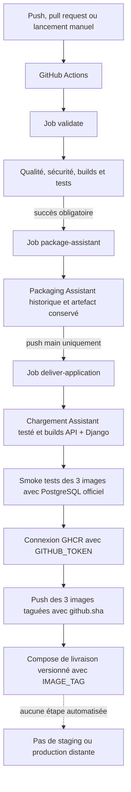

# C19 — Chaîne de livraison continue

## 1. Objet

Ce document audite ce que le dépôt `ludivineRB/surendettement_analyse` permet réellement de
démontrer pour la compétence C19 du bloc 3 RNCP37827. Il prolonge l’analyse C18 sans assimiler
la validation, le packaging, la publication d’un artefact, la livraison et le déploiement.

L’audit porte sur les sources et l’historique Git accessibles localement. Le correctif C19
ajoute une livraison GHCR des trois composants applicatifs. Une capture d’un run réussi sur
`main` reste nécessaire pour prouver l’exécution distante effective.

## 2. Périmètre

Le point de départ est `docs/e4/C18_INTEGRATION_CONTINUE.md`. C18 couvre la préparation de
l’environnement, les contrôles, les tests et les builds. C19 commence après cette validation et
cherche à établir si un livrable vérifié est transmis vers une destination exploitable.

Ont été vérifiés : le workflow GitHub Actions, les scripts CI, le Dockerfile, les fichiers
Compose de base, staging et production, les documentations CI/production, les recherches de
registre, release, publication et déploiement, ainsi que l’ancienne expérience Render visible
dans l’historique Git.

Le dépôt ne contient pas `docker/compose.prod.yaml`. Le fichier réellement versionné et utilisé
par la CI est `docker/compose.production.yaml`.

## 3. Différence CI / packaging / livraison / déploiement

| Notion | Définition retenue | Situation du dépôt |
|---|---|---|
| Intégration continue | Préparer, contrôler, construire et tester chaque changement | Présente avec GitHub Actions et `docker/run_ci.sh` |
| Packaging | Transformer les sources validées en unités transportables et versionnées | Présent pour Django, l’API analytique et l’Assistant API |
| Publication d’artefact | Déposer un fichier issu du run dans GitHub Actions | Présente pendant 14 jours |
| Livraison | Mettre le livrable validé à disposition d’un consommateur ou de l’étape suivante selon une procédure définie | Configurée vers GHCR avec trois tags identiques au SHA Git |
| Déploiement | Installer et exécuter une version sur un environnement cible | Absent de la chaîne actuelle |

La publication GHCR rend les trois images récupérables et le Compose de livraison permet leur
assemblage. Elle ne les installe pas sur un staging ou une production.

## 4. État actuel de la chaîne

La chaîne livre les images applicatives versionnées et la configuration nécessaire à leur
assemblage. Elle ne déploie pas automatiquement l’application sur une infrastructure distante.

### Historique de la correction

| Phase | Situation |
|---|---|
| État avant correction | Seule l’image Assistant était packagée, smoke-testée et publiée comme artefact Actions temporaire |
| Écart identifié | Le service IA seul ne représentait pas l’application E4 composée de Django, de l’API analytique et de l’Assistant |
| Périmètre retenu | Trois images applicatives, PostgreSQL officiel et Compose d’assemblage versionné |
| Correction | Job `deliver-application`, publications GHCR au même SHA et `docker/compose.delivery.yaml` |
| État après correction | Livraison automatisée définie ; preuve d’un premier run réussi sur `main` encore requise |

### Contrôle de non-régression

| Vérification | Avant | Après | Régression |
|---|---|---|---|
| Déclencheurs CI | Push, pull request, manuel | Inchangés | Non |
| Job `validate` | Chaîne complète C18 | Inchangé | Non |
| Packaging Assistant | Build, smoke, archive et artefact | Inchangé | Non |
| Smoke Assistant historique | `/health` | Conservé | Non |
| Artefacts et rétention | Deux artefacts, 14 jours | Conservés | Non |
| Compose local | Valide | Inchangé et revalidé | Non |
| Compose staging | Valide | Inchangé et revalidé | Non |
| Compose production | Valide syntaxiquement | Inchangé et revalidé | Non |
| Livraison applicative | Absente de GHCR | Nouveau job isolé sur push `main` | Ajout sans effet sur les PR |
| Images applicatives | Assistant seulement packagé | Trois builds et smoke tests locaux réussis | Non constatée |

## 5. Déclencheurs

| Déclencheur | Configuration | Effet sur C19 | Preuve |
|---|---|---|---|
| `pull_request` | Aucun filtre de branche ou chemin | Peut lancer validation et packaging après succès | `.github/workflows/ci.yml` |
| `push` | Aucun filtre de branche ou chemin | Peut lancer validation et packaging après succès | `.github/workflows/ci.yml` |
| `workflow_dispatch` | Lancement manuel | Permet de produire un artefact à la demande | `.github/workflows/ci.yml` |

Les runs d’une même référence sont regroupés et les runs obsolètes annulés. Le job de livraison
porte la condition `github.event_name == 'push' && github.ref == 'refs/heads/main'`. Les pull
requests continuent donc la validation et le packaging historique sans publication GHCR ni
permission d’écriture de packages. Aucun déclencheur de déploiement n’est défini.

## 6. Packaging

Le job `package-assistant` dépend de `validate` avec `needs: validate`. Il ne commence donc
qu’après réussite de la validation. Sur un runner `ubuntu-latest`, il :

1. récupère les sources avec `actions/checkout@v4` ;
2. construit la cible `assistant-api` de `docker/Dockerfile` ;
3. applique le tag `surendettement-assistant:${{ github.sha }}` ;
4. démarre exactement cette image et vérifie `/health` ;
5. produit les métadonnées par `docker image inspect` ;
6. exporte l’image par `docker save | gzip` ;
7. publie le répertoire `app/reports/delivery/` comme artefact Actions.

Ce packaging historique reste inchangé. Après son succès, `deliver-application` télécharge et
charge cette image déjà testée, puis construit les cibles existantes `api` et `django`. Les noms
de livraison sont :

- `ghcr.io/ludivinerb/surendettement-api:<SHA>` ;
- `ghcr.io/ludivinerb/surendettement-django:<SHA>` ;
- `ghcr.io/ludivinerb/surendettement-assistant:<SHA>`.

Le SHA est exclusivement `${{ github.sha }}` ; aucun tag flottant `latest` n’est publié. Le job
dispose localement de `contents: read` et `packages: write`, puis utilise `GITHUB_TOKEN` avec
`docker/login-action@v3`. Aucun PAT ou secret externe n’est ajouté.

| Élément | Build | Test | Package | Livré |
|---|:---:|:---:|:---:|---|
| Assistant API | Oui | Tests CI et smoke `/health` | Oui, archive historique et image OCI | GHCR au SHA sur push `main` |
| API analytique | Oui | Tests CI et smoke `/health/live` | Oui, image OCI | GHCR au même SHA |
| Django | Oui | Tests CI et smoke `/health/live/` | Oui, image OCI | GHCR au même SHA |
| Streamlit | Pas de build explicite dans `run_ci.sh` | Tests indirects seulement | Non | Non |
| PostgreSQL | Image officielle `postgres:16-alpine` | Migration, intégration et support des smoke tests | Non repackagée | Référencée dans Compose |
| Application E4 | Trois images applicatives | Tests par familles et smoke tests | Compose de livraison | Livrable cohérent au même SHA |

Streamlit reste dans le dépôt et dans les Compose historiques, mais n’appartient pas au
périmètre C19 : Django est l’interface principale présentée pour l’application E4.

## 7. Smoke test

Le workflow historique démarre l’image sous le nom `assistant-smoke`, publiée uniquement sur
`127.0.0.1:8030`. Une boucle effectue jusqu’à 20 essais espacés de 2 secondes et appelle
`http://localhost:8030/health` depuis le conteneur. Sans réponse dans cette fenêtre, les logs
sont affichés et l’étape échoue.

Ce contrôle démontre que le processus de l’image packagée démarre et répond sur son endpoint de
liveness. Il ne teste ni `/health/ready`, ni PostgreSQL, ni l’API analytique, ni OpenAI, ni le
parcours complet Django → Assistant. C’est un smoke test de package, pas un test post-livraison
sur une cible distante.

Avant publication GHCR, le nouveau job démarre un PostgreSQL officiel éphémère, puis les trois
images exactes destinées à la publication. Il vérifie les routes existantes suivantes :

| Image | Route | Dépendance du smoke test |
|---|---|---|
| API analytique | `/health/live` | Aucune connexion métier requise |
| Django | `/health/live/` | PostgreSQL officiel requis au démarrage par la vérification des migrations |
| Assistant API | `/health` | Aucune connexion fournisseur requise |

Chaque sonde dispose de 20 essais espacés de 2 secondes. Une sonde en échec interrompt le job
avant le login et les `docker push`. Les conteneurs et le réseau temporaires sont arrêtés dans
une étape `if: always()`.

## 8. Artefacts

| Artefact | Contenu | Nom GitHub Actions | Rétention | Nature |
|---|---|---|---:|---|
| Métadonnées image | Sortie JSON de `docker image inspect` | `assistant-image-<SHA>` | 14 jours | Traçabilité technique |
| Image compressée | `surendettement-assistant-<SHA>.tar.gz` | `assistant-image-<SHA>` | 14 jours | Package Assistant transportable |
| Rapports CI | JUnit, couverture, RAG, Text-to-SQL, migration | `validation-reports-<run_id>` | 14 jours | Preuves de validation |

`if-no-files-found: error` rend l’absence du package bloquante. En revanche, aucune somme de
contrôle externe, signature, attestation, SBOM ou provenance normalisée n’est produite.

L’artefact est attaché à un run Actions, pas à une GitHub Release. Sa durée de 14 jours et son
accès via GitHub le distinguent d’un registre d’images ou d’une release durable.

Les artefacts historiques, y compris `image-metadata.json`, l’archive Assistant et les rapports
CI, sont conservés sans modification. GHCR vient en complément et évite d’élargir les archives
aux trois images.

## 9. Livraison actuellement démontrée

Le workflow définit désormais une livraison automatisée dans GHCR après validation et smoke
tests. L’image Assistant poussée est celle chargée depuis l’archive du job historique déjà
testée ; elle n’est pas reconstruite. Les images API et Django sont construites, testées puis
poussées sans rebuild intermédiaire. La garantie « image testée = image publiée » est donc
respectée pour les trois composants.

Cette livraison ne comporte toujours ni GitHub Release, ni promotion vers un environnement
protégé, ni installation sur une machine, ni healthcheck distant post-déploiement, ni rollback
automatique. Tant qu’un run `main` réussi n’a pas été capturé, l’exécution des trois publications
GHCR reste à démontrer.

## 10. Staging et production

### Staging

`docker/compose.staging.yaml` est un overlay minimal qui fixe `APP_ENV=staging` pour PostgreSQL,
l’API analytique, Streamlit et Django. Il ne définit ni hôte, ni domaine, ni fournisseur, ni
secret distant.

Le fichier est :

- validé syntaxiquement par `docker compose ... config --quiet` dans `docker/run_ci.sh` ;
- réellement combiné au Compose principal par `docker/test_postgres_migration.sh` pour démarrer
  PostgreSQL et des conteneurs API sur le runner CI ou en local.

Cette exécution sert à tester une migration sur un environnement Compose jetable. Elle ne
constitue pas un déploiement sur un staging distant.

### Production

`docker/compose.production.yaml` ajoute des politiques de redémarrage, `init`, des healthchecks
et des dépendances pour plusieurs services. La CI le combine au fichier principal uniquement
avec `docker compose ... config --quiet`.

Cette commande reconnaît et valide la configuration fusionnée, mais ne construit ni ne démarre
une production. Aucun `up`, hôte, domaine, proxy TLS ou mécanisme d’accès à une infrastructure
de production n’est associé à cet overlay. `docker/PRODUCTION_CHECKLIST.md` confirme que les
conditions de mise en production restent à valider et que le déploiement automatique est
désactivé.

### Compose de livraison

`docker/compose.delivery.yaml` est additif et ne modifie aucun Compose existant. Il référence
les trois images GHCR avec `${IMAGE_TAG:?IMAGE_TAG is required}` et conserve
`postgres:16-alpine`, les volumes, variables, dépendances et healthchecks nécessaires à
l’assemblage. Il ne contient aucun `build:` : avec `IMAGE_TAG=<SHA>`, l’opérateur récupère
exactement les trois images livrées au même commit au lieu de les reconstruire localement.

## 11. Fichiers de configuration

| Fichier | Reconnu/validé | Exécuté | Utilité | Preuve |
|---|---|---|---|---|
| `.github/workflows/ci.yml` | Reconnu par GitHub Actions ; structure auditée | Exécution à prouver par capture d’un run | Orchestration CI et packaging | Déclencheurs et jobs du workflow |
| `docker/run_ci.sh` | Syntaxe shell vérifiable | Oui, appelé par `validate` | Chaîne de validation en huit blocs | Étape `Run reproducible validation` |
| `docker/test_postgres_migration.sh` | Appelé par le script CI | Oui | Migration et validation PostgreSQL jetables | Bloc 6 de `docker/run_ci.sh` |
| `docker/Dockerfile` | Lu par Docker | Oui pour les cibles `api`, `assistant-api`, `django`, `ci` | Construction des images | Scripts et job packaging |
| `docker/compose.yaml` | `config --quiet` | Oui : builds, runs et PostgreSQL | Socle local et CI | `docker/run_ci.sh` et script migration |
| `docker/compose.staging.yaml` | `config --quiet` | Oui, pour la validation PostgreSQL jetable uniquement | Valeur `APP_ENV=staging` | Deux scripts CI |
| `docker/compose.production.yaml` | `config --quiet` | Non comme environnement ; validation syntaxique seulement | Politique prévue pour la production | Bloc Compose de `docker/run_ci.sh` |
| `docker/compose.delivery.yaml` | Validation locale `docker compose config --quiet` | Utilisation manuelle après livraison ; aucun déploiement automatique | Assemblage des trois images GHCR et PostgreSQL officiel | Fichier C19 versionné |
| `docker/compose.prod.yaml` | Absent | Non | Nom cité dans la demande mais inexistant | Inventaire du dépôt |
| `docker/CI.md` | Documentation Markdown | Non applicable | Reproduction et limites de la CI | Fichier versionné |
| `docker/PRODUCTION_CHECKLIST.md` | Documentation Markdown | Non applicable | Conditions préalables à une production | Fichier versionné |

Le terme « exécuté » est réservé ici aux scripts lancés et aux configurations effectivement
utilisées pour construire ou démarrer des conteneurs. Une validation `config --quiet` ne prouve
pas l’exécution de l’environnement décrit.

## 12. Versionnement

Le workflow, le Dockerfile, les fichiers Compose, les scripts et les documentations sont suivis
par Git. Le remote `origin` pointe vers
`git@github.com:ludivineRB/surendettement_analyse.git`. La branche de référence est `main` ; le
présent audit est préparé sur `finalisation_e5`.

Le tag Docker de packaging reprend `github.sha`, ce qui relie le package au commit du run. Le
nom de l’artefact reprend également ce SHA. Les fichiers locaux ne permettent toutefois pas de
prouver une protection de branche, l’existence d’une release ou la réussite du dernier run.

### Ancienne expérimentation Render

L’historique Git prouve l’ajout expérimental de `render.yaml` au commit `51a4e8c`, plusieurs
corrections ultérieures, puis sa suppression au commit
`d04f13698eeed4f4b8320c94f6b9750a137f92d7` (`restore: return main content to 14be463`). Le
fichier n’existe plus dans l’arbre de travail ni dans la configuration actuelle.

Cette séquence constitue un **retour d’expérience / une expérimentation de déploiement**. Elle
ne constitue ni une cible actuelle, ni une chaîne CD active, ni une preuve de déploiement
réussi. La documentation C16 indique d’ailleurs que cette tentative n’a pas fourni de cible
retenue et que le socle local a été restauré.

## 13. Procédure actuelle

La procédure de livraison est la suivante :

1. déclencher le workflow par push, pull request ou `workflow_dispatch` ;
2. attendre la réussite du job `validate` ;
3. vérifier la réussite de `package-assistant` et du smoke test `/health` ;
4. vérifier les trois smoke tests et les trois `docker push` ;
5. vérifier dans GHCR les packages API, Django et Assistant portant exactement ce SHA ;
6. récupérer le dépôt au même commit ;
7. définir `IMAGE_TAG=<SHA>` ainsi que les variables et secrets d’exécution requis ;
8. vérifier la configuration avec
   `docker compose -f docker/compose.delivery.yaml config --images` ;
9. récupérer les images avec `docker compose -f docker/compose.delivery.yaml pull` ;
10. assembler manuellement les services avec ce même fichier Compose et effectuer les contrôles
    de readiness adaptés à l’environnement.

Les étapes 1 à 5 relèvent de la livraison automatisée sur un push vers `main`. Les étapes 6 à
10 sont une consommation manuelle du livrable. Elles ne sont pas présentées comme un
déploiement automatique.

## 14. Limites

- aucune preuve de run `main` ayant déjà publié les trois packages GHCR ;
- absence de GitHub Release, de signature et de SBOM ;
- aucun déploiement automatisé ou manuel démontré par une preuve cible actuelle ;
- aucun healthcheck post-livraison distant ;
- staging et production sont des configurations locales, non des infrastructures ;
- aucune approbation d’environnement, stratégie de promotion ou gestion automatisée du
  rollback ;
- les données, migrations initiales et secrets restent de la responsabilité de l’environnement
  consommateur ;
- Django utilise encore `runserver`, limite connue avant toute production publique.

## 15. Écarts C19

| Critère C19 | Situation actuelle | Statut | Écart |
|---|---|---|---|
| Documentation des étapes, tâches et déclencheurs | C18, C13 et le présent document décrivent les faits | Conforme après intégration de ce document | Preuve de consultation GitHub à capturer |
| Fichiers de chaîne reconnus et exécutés | Workflow, scripts, Dockerfile et Compose utilisés ; livraison ajoutée et syntaxiquement validée | Conforme sous réserve | Premier run distant et consommation du Compose à capturer |
| Packaging intégré et sans erreur | Trois images construites/testées après `validate`; package Assistant historique conservé | Conforme sous réserve | Réussite réelle du nouveau job à capturer |
| Livraison après validation du packaging | Trois pushes GHCR seulement après tous les smoke tests | Conforme sous réserve | Packages distants non encore observés |
| Sources versionnées et accessibles à distance | Fichiers suivis par Git et remote GitHub configuré | Conforme | Accessibilité effective à montrer au jury |
| Procédure de livraison documentée | SHA, run, packages, checkout, `IMAGE_TAG` et Compose décrits | Conforme | Exécution manuelle à illustrer |

## 16. Options de remédiation

| Option évaluée | Couverture E4 | Complexité | Risque de régression | Modifications nécessaires |
|---|---|---|---|---|
| A — Assistant seul dans GHCR | Insuffisante : service IA sans application intégrée | Faible | Faible | Publication d’une seule image |
| B — Trois images dans GHCR | Bonne, mais assemblage non fourni | Moyenne | Faible | Builds, smoke tests et trois publications |
| C — Trois images et Compose de livraison | Complète pour le périmètre applicatif E4 | Moyenne | Faible à modéré | Option B et Compose additif utilisant `IMAGE_TAG` |
| D — Release avec trois archives et Compose | Complète mais plus lourde à distribuer | Moyenne | Faible | Trois exports, release et procédure de chargement |

L’option C est mise en œuvre. Elle réutilise exclusivement les cibles Docker et les sondes
existantes. PostgreSQL reste officiel, les Compose locaux restent inchangés et aucun système de
déploiement n’est créé.

## 17. Recommandation

La recommandation retenue est l’option C. C’est le plus petit périmètre permettant de défendre
la livraison de **l’application E4**, et non du seul service IA : Django fournit l’interface,
l’API analytique fournit les données structurées, l’Assistant API fournit le service IA et
PostgreSQL demeure une dépendance officielle assemblée par Compose.

Le correctif est isolé au workflow et à un nouveau fichier Compose. Il ne modifie ni les images,
ni le code, ni les contrats, ni la base. Le principal risque résiduel concerne l’autorisation
GitHub de créer les packages sous `ghcr.io/ludivinerb`; il doit être levé par un run réel sur
`main`.

## 18. Preuves à capturer

### Preuves disponibles maintenant

1. workflow affichant `needs: validate` et les étapes de `package-assistant` ;
2. job `validate` réussi ;
3. job `package-assistant` réussi ;
4. trois cibles Docker existantes et trois noms GHCR au même SHA ;
5. trois smoke tests locaux réussis ;
6. artefact `assistant-image-<SHA>` et rétention de 14 jours ;
7. contenu de l’artefact : archive et métadonnées ;
8. correspondance entre SHA du run, tag Docker et nom du fichier ;
9. validation syntaxique de `docker/compose.delivery.yaml` avec `IMAGE_TAG` ;
10. configurations staging/production historiques inchangées ;
11. absence actuelle de `render.yaml` et historique de sa suppression.

### Preuves à produire sur GitHub

1. run réussi déclenché par un push sur `main` ;
2. job `deliver-application` exécuté après les deux jobs requis ;
3. trois smoke tests réussis avant la connexion au registre ;
4. trois packages visibles dans GHCR avec le même tag SHA ;
5. `docker compose ... config --images` montrant ces trois références ;
6. téléchargement des trois images avec `docker compose ... pull`.

## 19. Matrice RNCP C19

| Critère RNCP C19 | Mise en œuvre | Preuve | Statut |
|---|---|---|---|
| Documentation de toutes les étapes, tâches et déclencheurs | Chaîne actuelle et limites décrites sans confondre les notions | Sections 3 à 13 | Conforme après intégration du document |
| Fichiers de configuration reconnus et exécutés | Workflow, Dockerfile et Compose de livraison validés localement | Section 11 | Conforme sous réserve d’un run distant |
| Packaging intégré et exécuté sans erreur | Trois images construites et smoke-testées localement | Workflow et contrôles locaux ; run à capturer | Conforme sous réserve de preuve d’exécution |
| Livraison après validation du packaging | Job conditionné par `validate` et `package-assistant`, puis trois pushes GHCR | Job `deliver-application` | Conforme sous réserve de preuve d’exécution |
| Sources versionnées sur un dépôt distant | Éléments suivis par Git, remote GitHub | Section 12 | Conforme |
| Procédure de livraison documentée | Run, SHA, GHCR, checkout et `IMAGE_TAG` explicités | Section 13 | Conforme |

## 20. Conclusion

Le statut global retenu est **C19 conforme sous réserve de preuve d’exécution**.

La chaîne préserve le packaging Assistant existant, livre les images Django, API analytique et
Assistant dans GHCR avec le même SHA, et fournit un Compose versionné pour les assembler avec
PostgreSQL officiel. Les trois images sont testées avant toute publication et aucune image n’est
reconstruite entre son test et son push.

La preuve manquante est un run réussi sur `main` démontrant les trois publications GHCR au même
SHA. La chaîne livre des composants versionnés ; elle ne déploie pas automatiquement
l’application sur une infrastructure distante.
